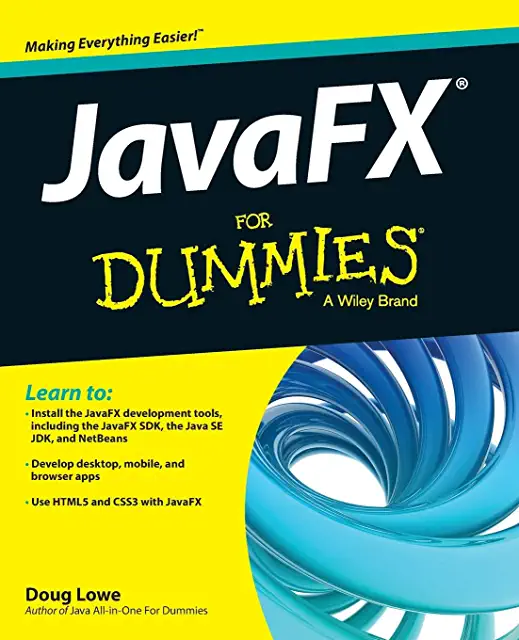

# JavaFX-For-Dummies-zh
> 跟阿呆学 JavaFX

## 目录

- [介绍](./docs/01-introduction.md)
  - 关于本书
  - 愚蠢的假设
  - 本书组织架构
    - Part Ⅰ: 开始使用 JavaFX
    - Part Ⅱ: JavaFX 控件
    - Part Ⅲ: 加强你的场景设计
    - Part Ⅳ: 让你的程序活起来
    - Part Ⅴ: 与“十”相关的部分
  - 本书使用的图标
  - 本书之外
  - 下一步该去哪儿
- Part Ⅰ：开始使用 JavaFX
  - Chapter 1: 你好，JavaFX
    - JavaFX 是什么？
    - 仔细研究 JavaFX 的可能性
    - 看看一个简单的 JavaFX 程序
    - 下载和安装 JavaFX
      - 下载 JDK 8
      - 安装 JDK 8
      - 设置 Path
    - 使用 Notepad 开发 Click Me 程序
    - 使用 TextPad 开发 Click Me 程序
    - 使用 IDE 创建 Click Me 程序
  - Chapter 2: 深入 JavaFX 程序设计
    - 再看 Click Me 程序
    - 导入 JavaFX 相关包
    - 继承 Application 类
    - 启动应用程序
    - 重写 start 方法
    - 创建按钮
    - 处理操作时间
    - 创建布局面板
    - 场景搭建
    - 舞台设置
    - 检查 Click Counter 程序
  - Chapter 3: 事件处理
    - 检查事件
    - 事件处理 
    - 实现 EventHandler 接口
    - 使用内部类处理事件
    - 使用匿名内部类处理事件
    - 使用 Lambda 表达式处理事件
  - Chapter 4: 设置窗口和场景布局
    - 检验 Stage 类
    - 检验 Scene 类
    - 切换场景
    - 创建对话框
    - 创建确认框
    - 退场，舞台右边
      - 创建关闭按钮
      - 处理 CloseRequest 事件
      - 把它们放在一起
  - Chapter 5: 使用布局面板布置你的场景
    - 使用布局面板
      - JavaFX 布局面板介绍
      - 创建布局面板
      - 组合布局面板
    - 使用 HBox 布局
    - 间距问题
    - 通过 Margin 增加空间
    - 通过添加节点增加空间
    - 使用 VBox 布局
    - 在布局面板中对齐节点
    - 使节点宽度保持一致
    - 使用 Flow 布局
    - 使用 Border 布局
  - Chapter 6: 获取用户输入
    - 使用文本框
    - 验证数值数据
    - 使用多选框
    - 使用单选按钮
    - 查看一个披萨订单应用程序
- Part Ⅱ：JavaFX 控件
  - Chapter 7: JavaFX 节点层级介绍
    - JavaFX 包概述
    - Node 类
    - Parent 类
    - Region 类
    - Control 类
  - Chapter 8: 从列表中选择
    - 使用选择框
      - 创建选择框
      - 设置默认值
      - 获取选中项
    - 使用 Observable List
    - 监听选择更改
    - 使用组合框
      - 创建组合框
      - 获取选中项
      - 处理组合框事件
    - 使用列表视图
      - 创建列表视图
      - 获取选中项
    - 使用树形视图
      - 构建 Tree
      - 创建一个 TreeView 控件
      - 获取选中的节点
      - 查看一个使用树形视图的完整程序
  - Chapter 9: 表格使用
    - 为表格创建数据
    - 创建只读表格
      - 使用 TableColumn 类
      - 使用 TableView 类
    - 创建只读表格的程序
    - 创建一个可编辑的表格
      - 添加行
      - 删除行
      - 编辑单元格
    - 创建可编辑表格的程序
  - Chapter 10: 创建菜单
    - 介绍用于创建菜单的类
    - 创建一个基本菜单栏
    - 创建菜单
    - 创建菜单项
    - 使用分割线
    - 使用操作监听器
    - 创建可更改的菜单
    - 使用多选和单选菜单项
    - 创建子菜单
    - 创建自定义菜单项
- Part Ⅲ：加强你的场景设计
  - Chapter 11: 更多与精确场景设计有关的布局面板
    - 使用 StackPane 布局
    - 使用 TilePane 布局
    - 使用 ScrollPane 布局
    - 使用 GridPane 布局
      - 为计划做草图 
      - 创建一个网格面板
      - 使用网格面板的约束条件
      - 查看网格面板示例
  - Chapter 12: 使用 CSS 为你的程序换肤
    - 使用默认样式表
    - 为场景添加样式表
    - 使用内联样式
    - 创建一个样式表
      - 使用类型选择器
      - 创建自己的样式类名
      - 使用 ID 选择器
      - 使用多个选择器
    - 指定样式属性
      - 指定字体属性
      - 指定背景颜色
      - 指定边框属性
  - Chapter 13: 图形绘制
    - Shape 类介绍
      - 创建线条
      - 创建矩形
      - 创建圆和椭圆形
      - 创建圆弧
      - 查看 ShapeMaker 程序
    - 花哨的填充
      - 绘制透明
      - 使用渐变填充
    - 平移，缩放和旋转
    - 绘制文本
    - 图形组合
  - Chapter 14: 添加特殊效果
    - 特殊效果介绍
    - 添加阴影
    - 创建反射
    - 使事物模糊
    - Blooming 和 Glowing
    - 获取透视图
    - 效果组合
- Part Ⅳ：让你的程序活起来
  - Chapter 15: 使用属性创建动态场景
    - JavaFX 属性介绍
    - Java API 属性
    - JavaFX 属性类
    - 创建一个读/写属性
    - 创建一个只读属性
    - 更高效地创建属性
    - 使用属性事件
    - 属性绑定
  - Chapter 16: 使用图像和媒体
    - 使用图像
      - 使用 Image 类
      - 使用 ImageView 类
      - 查看图像示例
    - 播放音频文件
    - 播放视频文件
  - Chapter 17: 设置场景动画
    - JavaFX 动画介绍
    - 使用转换类
    - 看看一个转换例子
    - 转换组合
    - 用艰难的方式制作动画
    - 改进 Ball Bouncer
  - Chapter 18: 针对触摸设备
    - 手势和触摸事件介绍
    - 手势监听
    - 查看一个示例程序
- Part Ⅴ：“十”的部分
  - Chapter 19: 10 个 JavaFX 控件
    - TitledPane
    - Accordion
    - ColorPicker
    - DatePicker
    - Hyperlink
    - ProgressIndicator 和 ProgressBar
    - Slider
    - ScrollBar
    - PasswordField
  - Chapter 20: 构建 3D 世界的 10 个步骤
    - 步骤 1: 添加透视相机
    - 步骤 2: 添加圆柱
    - 步骤 3: 创建材质
    - 步骤 4: 移动圆柱
    - 步骤 5: 添加盒子
    - 步骤 6: 旋转盒子
    - 步骤 7: 添加球体
    - 步骤 8: 添加网格对象
    - 步骤 9: 添加动画
    - 步骤 10: 添加光源
    - 放在一起: 完整的 3D 世界程序
- 索引

