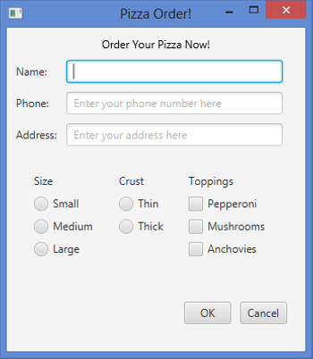
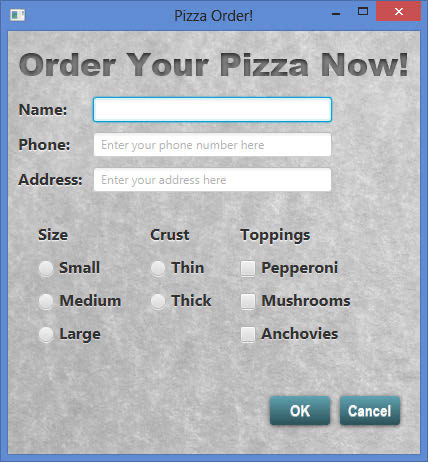
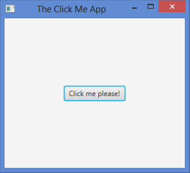
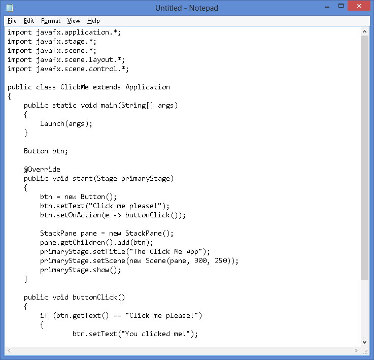
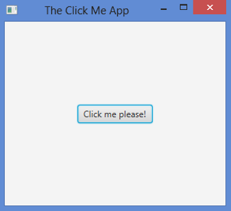
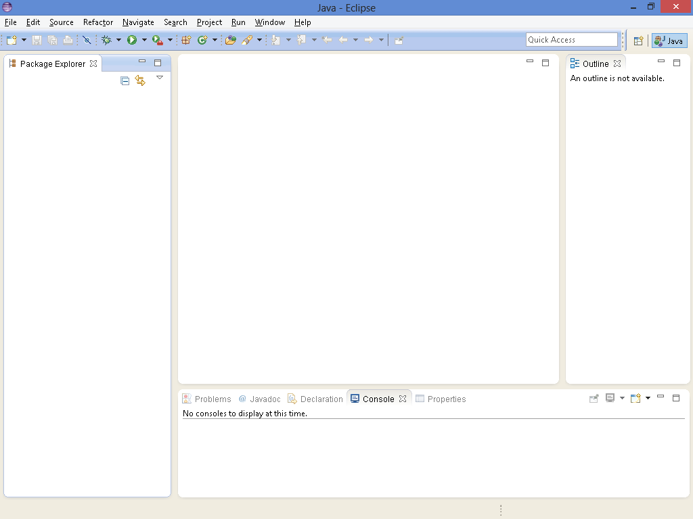
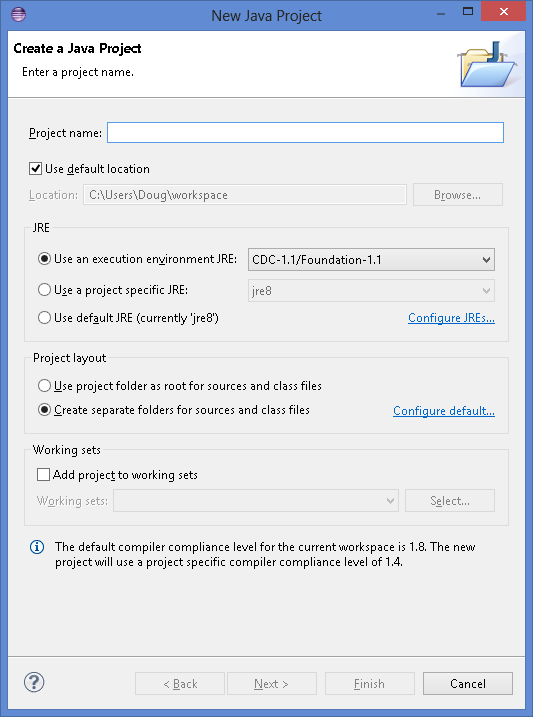
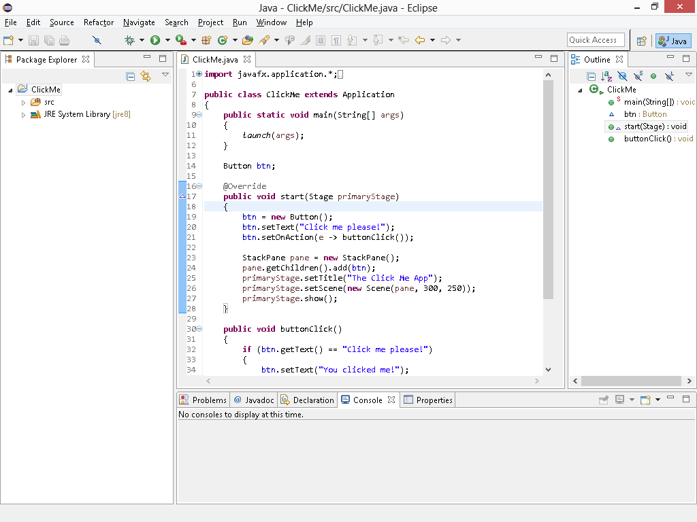

# Chapter 1 你好， JavaFX！

> **In This Chapter**
>
> - Getting a quick overview of what JavaFX is and what you can do with it 
> - Looking at a basic JavaFX program
> - Downloading, installing, and configuring Java 8 so you can build your own JavaFX programs
> - Building a JavaFX program the hard way, using nothing but Notepad and a command prompt
> - Using TextPad to simplify JavaFX programming
> - Using an IDE, such as Eclipse or NetBeans, for JavaFX programming

Welcome to the wonderful world of JavaFX programming!

This chapter offers a gentle introduction to JavaFX programming. In the next few pages, you find out what JavaFX is, where it came from, and where it’s going. You see an example of the classic Hello, World! program implemented in JavaFX. And you discover how to set up your computer to develop your own JavaFX programs using several popular development tools for JavaFX.

Incidentally, I assume that you’re already somewhat familiar with Java programming. You don’t need to be a master programmer by any means, but you should have a solid understanding of the basics, such as creating programs that work with variables and statements (such as `if` and `for`) as well as creating your own classes and using the various classes that are part of the Java API (Application Programming Interface). I don’t take the time to explain such basics in this book, so if you need an introduction to Java before you dive into the details of JavaFX, I suggest you get a copy of my masterpiece, *Java All-in-One For Dummies* (Wiley Publishing, Inc.).

The intent of this chapter is to get you ready to start learning how to write JavaFX programs. As such, you see a brief example of a simple JavaFX program in this chapter, which might not make complete sense at this early stage of your JavaFX journey. Please don’t become discouraged. In Chapter 2, I dissect that simple JavaFX program line-by-line so you can see what makes it tick. For this chapter, I focus on the high-level details of what JavaFX is, what you can do with it, and how to get your computer set up for JavaFX programming.

All the code listings used in this book are available for download at www.dummies.com/extras/javafx.

## JavaFX 是什么？

Simply put, JavaFX is a collection of Java packages that lets you add fancy graphical user interfaces to your Java applications. With JavaFX, you can create traditional windows-style user interfaces that include familiar controls such as labels, buttons, text boxes, check boxes, drop-down lists, and so on. But you can also adorn these user interfaces with fancy effects such as light sources, perspective, and animation. Hence the *FX* in *JavaFX*.

Prior to JavaFX, the main way to create graphical user interfaces in Java was through the Swing API. JavaFX is similar to Swing in many ways, so if you’ve ever used Swing to create a user interface for a Java program, you have a good head start at learning JavaFX.

JavaFX has been around as an add-on package for a while, but beginning with Java version 8, JavaFX is now an official standard part of the Java platform. Thus, after you install the Java 8 Development Kit (*JDK 8*), you can begin developing your own JavaFX applications with your favorite development tools. Later in this chapter, you discover how to download and install JDK 8, and you figure out how to create a simple JavaFX program using three popular Java development tools: TextPad, Eclipse, and NetBeans.

Because JavaFX is now a standard part of Java, you can run your JavaFX programs on any device that includes version 8 of the Java Runtime Environment (JRE). That includes computers, tablet devices, smartphones, and any other device that can support JDK8.

Oracle has announced that JavaFX will eventually replace Swing. Although Swing is still supported in Java 8 and will be supported for the foreseeable future, Oracle is concentrating new features on JavaFX. Eventually, Swing will become obsolete.

## 仔细研究 JavaFX 的可能性

One of the basic strengths of JavaFX is its ability to let you easily create complicated graphical user interfaces with all the classic user interface gizmos everyone knows and loves. Thus, JavaFX provides a full range of controls — dozens of them in fact, including the classics such as buttons, labels, text boxes, check boxes, drop-down lists, and menus, as well as more exotic controls such as tabbed panes and accordion panes. Figure 1-1 shows a typical JavaFX user interface that uses several of these control types to create a form for data entry.

> Figure 1-1: A typical JavaFX program.



Truthfully, the data-entry form shown in Figure 1-1 isn’t very remarkable. In fact, you can easily create data-entry forms like this using Swing with about the same amount of effort. The real advantages of using JavaFX over Swing don’t become apparent until you start using some of the more advanced JavaFX features.

For starters, consider the general appearance of the data-entry form shown in Figure 1-1. The appearance of the buttons, labels, text fields, radio buttons, and check boxes are a bit dated. The visual differences between the dialog box shown in Figure 1-1 and one you could’ve created in Visual Basic on a Windows 95 computer 20 years ago are minor.

Where JavaFX begins to shine is in its ability to easily allow you to improve the appearance of your user interface by using Cascading Style Sheets (*CSS*). CSS makes it easy to customize many aspects of the appearance of your user interface controls by placing all the formatting information in a separate file dubbed a style sheet. A style sheet is a simple text file that provides a set of rules for formatting the various elements of the user interface. You can use CSS to control literally hundreds of formatting properties. For example, you can easily change the text properties such as font, size, color, and weight, and you can add a background image, gradient fills, borders, and special effects such as shadows, blurs, and light sources.

Figure 1-2 shows a variation of the form that was shown in Figure 1-1, this time formatted with CSS. The simple CSS file for this form adds a background image, enhances the text formatting, and modifies the appearance of the buttons.

> Figure 1-2: JavaFX lets you use CSS to specify formatting for user interface elements.



Besides CSS, JavaFX offers many other capabilities. These are the most important:

> **✓ Visual effects:** You can add a wide variety of visual effects to your user interface elements, including shadows, reflections, blurs, lighting, and perspective effects.
>
> **✓ Animation:** You can specify animation effects that apply transitions gradually over time.
>
> **✓ Charts:** You can create bar charts, pie charts, and many other chart types using the many classes of the `javafx.scene.chart package`.
>
> **✓ 3-D objects:** You can draw three-dimensional objects such as cubes, cylinders, spheres, and more complex shapes.
>
> **✓ Touch interface:** JavaFX can handle touchscreen devices, such as smartphones and tablet computers with ease.
>
> **✓ Property bindings:** JavaFX lets you create *properties*, which are special data types that can be bound to user interface controls. For example, you can create a property that represents the price of an item being purchased and then bind a label to it. Then, whenever the value of the price changes, the value displayed by the label is updated automatically.

You discover all these features and more in later chapters of this book. But for now, it’s time to have a look at a simple JavaFX program so you can get a feel for what JavaFX programs look like.

## 看看一个简单的 JavaFX 程序

Figure 1-3 shows the user interface for a very simple JavaFX program that includes just a single button. Initially, the text of this button says `Click me please!` When clicked, the text of the button changes to `You clicked me!` If you click the button again, the text changes back to `Click me please!` Thereafter, each time you click the button, the text cycles between `Click me please!` and `You clicked me!`

> Figure 1-3: The Click Me program.



To give you an idea of what JavaFX programming looks like, Listing 1-1 shows the complete listing for this program. I won’t explain the details of how this program works — I examine this program in painstaking detail in Chapter 2. For now, I just want you to get the big picture to give you a feel for what JavaFX programming looks like.

**Listing 1-1: The Click Me Program**

```java
import javafx.application.*; 
import javafx.stage.*; 
import javafx.scene.*; 
import javafx.scene.layout.*; 
import javafx.scene.control.*;

public class ClickMe extends Application {

  public static void main(String[] args) { 
    launch(args); 
  }

  Button btn;

  @Override 
  public void start(Stage primaryStage) {
    // Create the button 
    btn = new Button(); 
    btn.setText("Click me please!"); 
    btn.setOnAction(e -> buttonClick());

    // Add the button to a layout pane 
    BorderPane pane = new BorderPane(); 
    pane.setCenter(btn); 
    // Add the layout pane to a scene 
    Scene scene = new Scene(pane, 300, 250);

    // Finalize and show the stage 
    primaryStage.setScene(scene); 
    primaryStage.setTitle("The Click Me App"); 
    primaryStage.show();
  }

  public void buttonClick() {
    if (btn.getText() == "Click me please!") {
      btn.setText("You clicked me!"); 
    } else {
      btn.setText("Click me please!"); 
    }
  }
}
```

The following paragraphs give a brief explanation of the key elements of the Click Me program:

> ✓ As with any other Java program, JavaFX programs begin with a slew of `import` statements that reference the various packages that will be used by the program.
>
> ​	For this example, five packages are imported. Most JavaFX programs will require these five packages as well as additional packages that provide more advanced features.
>
> ✓ All JavaFX programs extend a core class named `Application`, which provides the basic functionality of the program. When you extend the `Application` class, you must override a `start` method; JavaFX calls this method when the application starts.
>
> ✓ Like any Java program, a JavaFX program must have a `main` method. In a JavaFX program, the `main` method simply calls the `launch` method of the `Application` class, which in turn launches the application and calls the `start` method.
>
> ✓ The user interface elements of a JavaFX program are arranged in a hierarchy of containers. At the highest level is a *stage*, which represents a window. Within the stage is a *scene*, which contains user interface controls. The controls themselves (such as buttons, labels, drop-down lists, and so on) are usually contained in one or more *layout panes* that govern the positional layout of the controls.
>
> ​	If you study the code in the `start` method, you see that these elements are built from the bottom up:
>
> ​		• A button is created.
>
> ​		• The button is added to a layout pane (specifically, a `StackPane`, which is one of several types of layout panes available).
>
> ​		• The layout pane is added to a scene and then the scene is added to the stage.
>
> ​		• The stage’s show method is called to display the application’s GUI (Graphical User Interface).
>
> ✓ The `buttonClick` method is called whenever the user clicks the button. This method examines the current text displayed by the button and changes the text accordingly. Thus, each time the user clicks the button, the button’s text changes from `Click me please!` to `You clicked me!` or vice-versa.
>

Please don’t worry if you find some (or even all) of this program confusing at this point. My intent for this chapter is simply to give you a peek at a simple JavaFX program, but not to overwhelm you with the details of how this program works. As I mention earlier, I will review the details of this program lineby-line in Chapter 2.

In the remaining sections of this chapter, you figure out how to download, install, and configure the Java Development Kit and how to compile and test the Click Me program using popular Java development tools.

## 下载和安装 JavaFX

Actually, the above heading is a bit of a trick. Prior to Java 8, JavaFX was a separate entity from Java. Thus, to use JavaFX, you had to download and install a separate JavaFX package. But beginning with Java 8, JavaFX is now an integral part of Java. So if you’ve downloaded and installed Java 8, you already have JavaFX.

In the following sections, I discuss how to download, install, and configure the Java 8 Development Kit (JDK 8) so that you can code and test JavaFX programs. If you’ve already installed JDK 8, you can skip the rest of this section.

### 下载 JDK 8

To get to the download page, point your browser to http://java.oracle. com/technetwork/java and then follow the appropriate links to download the JDK 8 for your operating system.

When you get to the Java download page, you find links to download the JDK or the JRE. Follow the JDK link; the JRE link gets you only the Java Runtime Environment, not the complete Java Development Kit.

The JDK download comes in two versions:

> ✓ The online version requires an active Internet connection to install the JDK.
>
> ​	The offline version lets you download the JDK installation file to your computer and install it later.

I recommend that you use the offline version; it installs faster, and you can reinstall the JDK later if you need to without downloading it again.

### 安装 JDK 8

After you download the JDK file, you can install it by running the executable file you downloaded. The procedure varies slightly depending on your operating system, but basically, you just run the JDK installation program file after you download it, as follows:

> ✓ On a Windows system, open the folder in which you saved the installation program and double-click the installation program’s icon.
>
> ✓ On a Linux or Solaris system, use console commands to change to the
>
> directory to which you downloaded the file and then run the program.
>
> ✓ On a Mac, open the Downloads window and double-click the JDK .dmg file you downloaded. A Finder window appears containing an icon of an open box. Double-click this icon to launch the installer.

After you start the installation program, it prompts you for any information that it needs to install the JDK properly, such as which features you want to install and what folder you want to install the JDK in. You can safely choose the default answer for each option.

### 设置环境变量

After you install the JDK, you need to configure your operating system so that it can find the JDK command-line tools. To do that, you must set the Path environment variable — a list of folders that the operating system uses to locate executable programs. To do this on a Windows system, follow these steps. You must be logged in as an administrator to make the changes described in this procedure.

1. Open the Control Panel.
   + On a Windows 7 or earlier system, open the Start menu and choose Control Panel.
   + On a Windows 8 or later system, click the Start button or press the Windows key, type Control Panel, and then press Enter.

2. Double-click the System icon.

   The System Properties page appears.

3. Click the Advanced System Settings link and then click the Environment Variables button.

   The Environment Variables dialog box appears, as shown in Figure 1-4.

   > Figure 1-4: The Environment Variables dialog box.

   

4. In the System Variables list, scroll to the Path variable, select it, and then click the Edit button.

   A little dialog box pops up to let you edit the value of the Path variable.

5. Add the JDK bin folder to the beginning of the Path value.

   Use a semicolon to separate the bin folder from the rest of the information that may already be in the path.

   Note: The name of the bin folder may vary on your system, as in this example:

   ```
   c:\Program Files\Java\jdk1.8.0\bin;other directories...
   ```

6. Click OK three times to exit.

   The first OK gets you back to the Environment Variables dialog box; the second OK gets you back to the System Properties page; and the third OK closes the System Properties page.

For Linux or Solaris, the procedure depends on which shell you’re using. For more information, consult the documentation for the shell you’re using. Note that this step is not necessary on Mac systems.

## Developing the Click Me Program with Notepad

After you install JDK 8, JavaFX is at your disposal. Strictly speaking, the only other tools besides JDK 8 you need to develop Java programs is a text editor and access to a command prompt. With the text editor, you create the Java source file, saving the file with the extension .java. Then, at the command prompt, you use Java’s command-line tools to compile and run the program.

Windows comes with the free text-editor Notepad that is adequate enough for creating simple Java source files. Notepad is a generic text editor that doesn’t know anything about the peculiarities of Java source code. As a result, Notepad doesn’t give you any assistance with details such as indenting, matching up left and right braces, or drawing your attention to syntax errors.

Nor will Notepad give you any help with compiling, running, or debugging a Java program. But Notepad does have the advantage of being free and simple to use. And, it’s already on your computer, so there’s nothing else to install.

Here are the steps for creating the Click Me program using Notepad and Java’s command-line tools:

1. Start Notepad.

   To do that in Windows 7 or 8:

   ​	a. Click the Start button (or press the Windows key on your keyboard).

   ​	b. Type notepad and then press Enter.

   Notepad comes to life, presenting you with an empty text editing window.

2. Type the Click Me program text shown in Listing 1-1 into the editing window.

   Be sure to type the text exactly as it appears in the listing. When you’re done, carefully review your work to make sure you typed it correctly.

   Figure 1-5 shows how the Click Me program appears when correctly entered into Notepad. (Note that the Notepad window shown in the figure is not large enough to display the entire source file; you must scroll the window to see the entire file.)

   > Figure 1-5: The Click Me program in Notepad.

   

3. Choose File➪Save to save the file using the name ClickMe.java.

   You can save the file in any folder you wish, but it is very important that the name be exactly ClickMe.java.

   The name of a Java source file must exactly match the name of the class it contains, right down to capitalization. Thus, if you save the file as clickme.java instead of ClickMe.java, the Click Me program won’t work.

4. Open a command prompt window.

   In Windows 7 or 8, to open the window:

   ​	a. Click the Start button or press the Windows key

   ​	b. Type cmd and press Enter.

5. Use the cd command to change to the folder in which you saved the source file in Step 3.

   For example, if you saved the file in C:\Java, enter the following command:

   ```
   cd C:\Java
   ```

6. Use the javac command to compile the program.

   Enter the following command:

   ```
   javac ClickMe.java
   ```

   Assuming you typed the program exactly right, the javac command doesn’t display any messages at all. If the program contains any errors, the compiler displays one or more error messages. If that happens, open the source file in Notepad, edit the text to correct the errors, save the file, and then repeat this step until no errors display.

7. Use the java command to run the program.

   Enter the following command:

   ```
   java ClickMe
   ```

   The window, as shown in Figure 1-6, appears.

   > Figure 1-6: The Click Me program in action.

   

8. Click the Click Me Please! button.

   When you click the button, the text displayed on the button changes to You clicked me!.

9. Close the Click Me program by clicking its Close button.

   Congratulations! You’ve successfully created your first JavaFX program!

## Developing the Click Me Program with TextPad

TextPad is an inexpensive ($33) text editor that you can integrate with the Java Development Kit (JDK) to simplify the task of coding, compiling, and running Java programs. It isn’t a true integrated development environment (IDE), as it lacks features such as integrated debugging, code generators, and drag-and-drop tools for creating graphical user interfaces.

TextPad is a popular tool for developing Java programs because of its simplicity and speed. It’s ideal for learning Java because it’s easy to use, so you can concentrate on learning Java rather than on learning how to use a complicated development environment.

You can download a free evaluation version of TextPad from Helios Software Solutions at www.textpad.com. You can use the evaluation version free of charge, but if you decide to keep the program, you must pay for it. (Helios accepts credit card payments online.)

If the Java JDK is already installed on your computer, when you install TextPad, TextPad automatically configures itself to compile and run Java programs. If you install the JDK after you install TextPad, you need to configure TextPad for Java by opening the Preferences dialog box (by choosing Configure➪Preferences), selecting Tools in the tree on the left side of the dialog box, and then choosing Add➪Java SDK Commands.

After you configure TextPad to compile and run Java programs, you can create the Click Me program by following these steps:

1. Start TextPad.

   TextPad automatically opens with an empty source document named Document1.

2. Choose File➪Save, type ClickMe.java, and then click Save.

   This saves the file with the name ClickMe.java. Saving the file with a name that uses the extension .java before you enter any text into the file lets TextPad slip into Java editing mode, which makes it easier for you to enter and edit the Java source code for the Click Me program.

3. Type the text of the Click Me program from Listing 1-1 into the Document1 window.

   The basic text-editing capabilities of TextPad are similar to just about any other text editor you’ve worked with, so you should have no trouble entering and editing the text of the Click Me program.

   As you edit the text, you may notice some of TextPad’s useful Java editing features. For example, TextPad automatically indents your code whenever you type an opening bracket, and then reverts to the previous indent when you type a closing bracket. TextPad also uses different colors to indicate keywords, variables, and other Java programming elements.

   Figure 1-7 shows how the Click Me program appears in TextPad.

   > Figure 1-7: The Click Me program in TextPad.

   

4. Choose Tools➪Compile Java to compile the program.

   If you prefer, you can use the keyboard shortcut Ctrl+1. Either way, the changes to your source file are automatically saved and the javac command is invoked to compile the program. If the program compiles successfully, the message Tool completed successfully appears in the Tool Results pane.

   If you made a mistake entering the Click Me program, the compiler generates error messages that display in the Tool Results pane. If you double-click the first line of each error message, TextPad takes you to the spot where the error occurred so you can correct the error.

5. Choose Tools➪Run Java Application to run the program.

   A command prompt window opens and then the Click Me program window opens (refer to Figure 1-6).

6. Click the Click Me Please! button.

   When you click the button, the text displayed on the button changes to You clicked me!.

7. Close the Click Me program by clicking its Close button.

   The Click Me program window is closed, but the command prompt window remains visible, displaying the message Press any key to continue. . .

8. Press any key to close the command prompt window.

   That’s all there is to it!

## Using an IDE to Create the Click Me Program

An IDE, or integrated development environment, is a powerful tool that combines sophisticated text-editing features along with the ability to compile, execute, and debug programs in a variety of programming languages. An IDE can keep track of multiple source files that make up a single Java programming project and can even keep track of multiple versions of the source files.

The two most popular IDEs for Java programming are Eclipse and NetBeans. Both are free, and both are comparable in their features. So the choice of which to use is a matter of preference. You can download Eclipse from www.eclipse.org. You can get NetBeans at https://netbeans.org.

In the rest of this chapter, I show you how to create the Click Me program in Eclipse. Although the steps for creating the Click Me program in NetBeans are different, the concepts are the same.

To get started with Eclipse, go to www.eclipse.org, click the Download Eclipse button, and download the current version of Eclipse IDE for Java Developers. Unlike most programs, Eclipse doesn’t have a complicated setup program. You just download the Zip file, extract all the files, and then run the Eclipse executable file (eclipse.exe) directly from the folder you extracted it to.

If you’re using Windows, you may want to add a desktop shortcut for Eclipse to make it more convenient to start. To do that, open the folder that contains the eclipse.exe file, right-click the file and drag it to the desktop, release the mouse button, and choose Create Shortcut from the menu that appears. Then you can start Eclipse by double-clicking this desktop shortcut.

Here are the steps for creating the Click Me program in Eclipse:

1. Start Eclipse by running the Eclipse.exe program file or doubleclicking its desktop shortcut.

   Eclipse comes to life, as shown in Figure 1-8.

   > Figure 1-8: Eclipse awaits your command.

   

2. Choose File➪New➪Java Project.

   The New Java Project dialog box appears, as shown in Figure 1-9.

   > Figure 1-9: Creating a new Java project.

   

   3. Type ClickMe in the Project Name field and then click Finish.

      Eclipse sets up the project and adds the project to the Package Explorer pane at the left side of the screen, as shown in Figure 1-10. (Initially, the project is collapsed so that just the top line of the project appears. For this figure, I expanded the project to reveal the subfolders named src and JRE System Library.)

      > Figure 1-10: The ClickMe project shows up in the Package Explorer pane.

      


4. Choose File➪New➪Class.

   The New Java Class dialog box appears, as shown in Figure 1-11.

5. Type ClickMe in the Name field and then click Finish.

   Eclipse adds a file named ClickMe.java to the src folder and opens the file in the editing pane, as shown in Figure 1-12. Notice that Eclipse has also added a short stub of code to help you get started with the class.

6. Delete the code stub in the ClickMe.java file; then type the text from Listing 1-1 into the editing pane.

   Figure 1-13 shows what the ClickMe.java file looks like when you have correctly entered the program text.

   > Figure 1-11: Adding a class file to the ClickMe project.

   

7. Choose Run➪Run to run the program.

   The Click Me program window opens, as shown earlier in Figure 1-6.

8. Click the Click Me Please! button.

   When you click the button, the text displayed on the button changes to You clicked me!.

9. Close the Click Me program by clicking its Close button.

   Congratulations! You have successfully created and run the Click Me program using Eclipse.

Now that you’ve seen you can develop the simple Click Me program using Notepad and command-line tools, the simple TextPad Java text editor, or a more complicated IDE such as Eclipse, you’re ready to start discovering the specifics of how JavaFX programs work. So, in Chapter 2, I detail what every line of this simple program does. Onward and upward!

> Figure 1-12: Eclipse displays the newly created ClickMe. java file.


> Figure 1-13: The finished Click Me program in Eclipse.

