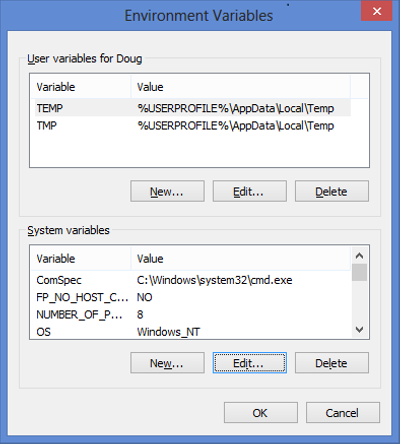
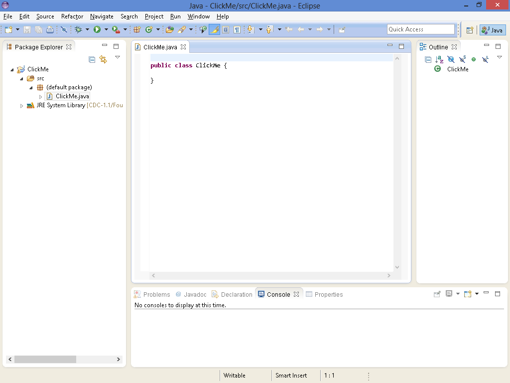

# 第 1 章  你好， JavaFX！

> **在本章节**
>
> - 快速了解什么是 JavaFX，可以使用它做什么
> - 查看一个基本的 JavaFX 程序
> - 下载，安装和配置 Java 8 以便构建你自己的 JavaFX 程序
> - 使用记事本和命令提示符这种较困难的方式构建 JavaFX 程序
> - 使用 TextPad 简化 JavaFX 编程
> - 使用 IDE（例如 Eclipse 或 NetBeans）进行 JavaFX 编程

欢迎来到奇妙的 JavaFX 编程世界！

本章对 JavaFX 编程进行了简单的介绍。在接下来的几页中，你将了解 JavaFX 是什么，来自哪里又去向何方。你会看到借助 JavaFX 实现的经典的 Hello World! 示例。你还将了解如何设置计算机，使用几种流行的 JavaFX 开发工具来开发 JavaFX 程序。

顺带一提，我假设你已经对 Java 编程有所了解。不需要你精通，但应该掌握基础知识，比如创建使用了一些变量和语句（例如 `if` 和 `for`）的程序，创建自己的类或者使用 Java API（应用程序编程接口）中包含的各种类。我不会花时间在本书中解释这些基础知识，如果深入研究 JavaFX 的细节之前需要 Java 的入门知识，建议你阅读我的杰作《 Java All-in-One For Dummies (Wiley Publishing, Inc.)》。

本章的目的是让你准备好开始学习如何编写JavaFX程序。因此，在本章中你将看到一个简单的 JavaFX 程序示例。在 JavaFX 之旅的早期阶段，你可能不能完全理解这个程序。但不要气馁，在第 2 章中，我会对它逐行分析，以便你了解它的作用所在。在这一章中，我主要从高层关注 JavaFX 是什么，你可以用它做什么，以及如何为 JavaFX 编程设置你的计算机。

本书中使用的所有代码清单都可以从 www.dummies.com/extras/javafx 下载。

## JavaFX 是什么？

简而言之，JavaFX 是一系列 Java 包的集合，它允许你为 Java 应用程序添加精美的图形用户界面。借助 JavaFX，你可以创建传统 Windows 风格的用户界面，其中包括熟悉的控件，如标签、按钮、文本框、复选框、下拉列表等。你还可以为这些用户界面添加一些特殊效果，例如光源，透视图和动画。这就是 JavaFX 中的 FX 由来。

JavaFX 出现之前，在 Java 中创建图形用户界面的主要方法是通过 Swing API。JavaFX 在许多方面与 Swing 有相似之处，所以如果你曾经使用过 Swing 为 Java 程序创建用户界面，这对学习 JavaFX 来说会是一个良好的开端。

JavaFX 作为附加包出现已经有一段时间了，但是从 Java 8 开始，它成为了 Java 平台官方标准的一部分。因此，在安装了 Java 8 开发工具包（*JDK 8*）之后，你就可以开始使用喜欢的开发工具开发 JavaFX 应用程序了。在本章的后面，你将知道如何下载和安装 JDK 8，以及如何使用三款流行的 Java 开发工具：TextPad、Eclipse 和 NetBeans 来创建一个简单的 JavaFX 程序。

因为 JavaFX 现在是 Java 标准的一部分，所以可以在任何包含 Java 8 运行时环境（JRE）的设备上运行 JavaFX 程序。这些设备包括计算机、平板、智能手机和其他支持 JDK8 的设备。

Oracle 已经宣布 JavaFX 最终将取代Swing。尽管 Java 8 仍然支持Swing，并且短期不会改变，但 Oracle 把主要精力放在 JavaFX 的新特性上。最终，Swing 将被淘汰。

## 仔细研究 JavaFX 的可能性

JavaFX 的基本优势之一是它能够让你轻松地使用所有大家都知道并且喜爱的经典用户界面元素了来创建复杂的图形用户界面。因此，JavaFX 提供了各种各样的控件 —— 实际上有几十种，囊括了经典的按钮、标签、文本框、复选框、下拉列表和菜单，以及一些独特的控件，如选项面板和折叠面板。图 1-1 显示了一个典型的 JavaFX 用户界面，它使用几种控件创建了一个用于数据输入的表单。

> 图 1-1：一个典型的JavaFX程序。


坦白讲，图 1-1 显示的数据输入表单不是很引人注目。实际上，使用 Swing 可以很容易地创建这样的数据输入表单，而且花费的工作量差不多。在开始使用一些更高级的 JavaFX 特性之前，相对于 Swing 的真正优势并不明显。

站在初学者的角度观察图 1-1 中所示的数据输入表单的整体外观，可以看出按钮、标签、文本字段、单选按钮和复选框的外观都有些过时，对话框也与 20 年前在 Windows 95 电脑上用 Visual Basic 创建的对话框看不出什么差别。

JavaFX 开始大放异彩的地方在于它能够使用级联样式表（*CSS*）轻松地改善用户界面的外观。CSS 通过将所有的格式化信息放在一个称为样式表的单独文件中，使得定制用户界面控件外观的许多方面变得容易。样式表是一个简单的文本文件，它提供一组规则来格式化用户界面的各种元素。你可以使用 CSS 控制数百个格式化属性。例如，更改文本属性（如字体、大小、颜色和粗细），添加背景图片、渐变填充、边框和特殊效果（如阴影、模糊和光源）。

图 1-2 显示了图 1-1 中所示形式的一种变体，这次使用了 CSS 进行格式化，为表单添加了背景图片，增强了文本格式，并修改了按钮的外观。

> 图 1-2：JavaFX 允许你使用 CSS 指定用户界面元素的格式。
>


除了 CSS，JavaFX 还提供了许多其他功能。其中最重要的有：

> **✓ 视觉效果：** 你可以为用户界面元素添加各种视觉效果，包括阴影，反射，模糊，照明和透视。
>
> **✓ 动画：** 你可以指定随时间逐渐过渡的动画效果。
>
> **✓ 图表：** 你可以使用 `javafx.scene.chart` 包的许多类来创建条形图，饼图和其他类型的图表。
>
> **✓ 3-D 对象：** 你可以绘制三维对象，例如立方体，圆柱体，球体以及更复杂的形状。
>
> **✓ 触摸界面：** JavaFX 可以轻松应对触屏设备，例如智能手机和平板电脑。
>
> **✓ 属性绑定：** JavaFX 允许你创建可以绑定到用户界面控件的特殊数据类型 *properties*（属性）。例如，你可以创建一个属性来表示所购买商品的价格，然后把它与一个标签进行绑定。当价格的值发生变化时，标签上显示的值就会自动更新。

在本书后续章节，你会了解到以上所有及更多的特性。但是现在，我们先来看看一个简单的 JavaFX 程序，这样可以让你对 JavaFX 程序有个大致的了解。

## 看看一个简单的 JavaFX 程序

图 1-3 显示了一个非常简单的 JavaFX 程序的用户界面，它只包含一个按钮。最初，按钮上显示的文字是 `Click me please!`。当按钮被点击后，文本变成了 `You clicked me!`。如果再次点击，文本会变回 `Click me please!` 。此后，每次单击按钮时，文本在 `Click me please!` 和 `You clicked me!` 之前交替变换。

> 图 1-3：Click Me 程序。
>


为了让你了解 JavaFX 编程是什么样的，清单 1-1 完整展示了这个程序。这里我不会解释程序工作的细节 —— 我会在第 2 章对它进行详细研究。现在，我只想让你对 JavaFX 编程有个总体认知。

**清单1-1：Click Me 程序**

```java
import javafx.application.*; 
import javafx.stage.*; 
import javafx.scene.*; 
import javafx.scene.layout.*; 
import javafx.scene.control.*;

public class ClickMe extends Application {

  public static void main(String[] args) { 
    launch(args); 
  }

  Button btn;

  @Override 
  public void start(Stage primaryStage) {
    // 创建按钮
    btn = new Button(); 
    btn.setText("Click me please!"); 
    btn.setOnAction(e -> buttonClick());

    // 将按钮添加到布局面板中
    BorderPane pane = new BorderPane(); 
    pane.setCenter(btn); 
    // 将布局面板添加到场景中
    Scene scene = new Scene(pane, 300, 250);

    // 完成并展示舞台
    primaryStage.setScene(scene); 
    primaryStage.setTitle("The Click Me App"); 
    primaryStage.show();
  }

  public void buttonClick() {
    if (btn.getText() == "Click me please!") {
      btn.setText("You clicked me!"); 
    } else {
      btn.setText("Click me please!"); 
    }
  }
}
```

以下段落简要说明了 Click Me 程序的关键点：

> ✓ 与其他 Java 程序一样，JavaFX 程序以大量的 `import` 语句开始，这些语句引用了该程序将要使用的各种包。
>
>   在本例中，导入了 5 个包。大多数 JavaFX 程序都需要这 5 个包，以及提供更多高级功能的附加包。
>
> ✓ 所有的 JavaFX 程序都要继承一个核心类 `Application`，它提供了程序的基本功能。继承 `Application` 类时必须重写 `start` 方法，JavaFX 会在应用程序启动时调用此方法。
>
> ✓ 与其他 Java 程序一样，JavaFX 程序必须有一个 `main` 方法。在 JavaFX 程序中，`main` 方法调用 `Application` 类的 `launch` 方法来启动应用程序并调用 `start` 方法。
>
> ✓ JavaFX 程序的用户界面元素按照容器层次结构进行排列。最顶层的是 `stage`（舞台），它代表一个窗口。在舞台内的是 `scene`（场景），其中包含用户界面控件。控件本身（例如按钮、标签、下拉列表等）通常包含在一个或多个布局面板（*layout panes*）中，这些面板管理着控件的位置布局。
>
>   如果你研究过 `start` 方法中的代码，会发现这些元素是自下而上构建的：
>
> - 创建一个按钮。
>- 将按钮添加到布局面板（具体来说是一个 `StackPane`，这是几种可用的布局面板之一）。
> - 将布局面板添加到场景中，然后把场景添加到舞台中。
>- 调用舞台的 `show` 方法显示应用程序的 GUI（图形用户界面）。 
> 
>✓ 每当用户单击按钮时，都会调用 `buttonClick` 方法。此方法检查按钮当前显示的文本，并进行相应更改。因此，每次用户单击该按钮时，按钮的文本都会从 `Click me please!` 变为 `You clicked me!` ，反之亦然。
> 

如果你发现这个程序的某些地方（或者全部）让你感到困惑，请不要担心。我写这一章的目的是让你看一眼这个简单的 JavaFX 程序，而不是让你对这个程序如何工作的细节感到不知所措。正如前面提到的，我将在第 2 章逐行回顾这个程序的细节。

在本章的剩余部分，你将了解如何下载、安装和配置 Java 开发工具包，以及如何使用流行的 Java 开发工具来编译和测试 Click Me 程序。

## 下载和安装 JavaFX

实际上，上面的标题耍了点花招。在 Java 8 之前，JavaFX 是一个独立于 Java 的实体。因此，要使用 JavaFX，你必须下载并安装一个单独的 JavaFX 软件包。但是从 Java 8 开始，JavaFX 便成为了 Java 的一部分。所以，如果已经下载并安装了 Java 8，那么你就已经拥有了 JavaFX。

在下面的章节中，我将说明如何下载、安装和配置 Java 8 开发工具包（JDK 8），以便编写和测试 JavaFX 程序。如果你已经安装了 JDK 8，可以跳过本章节。

### 下载 JDK 8

在浏览器输入 http://java.oracle.com/technetwork/java 进入下载页面，根据你的操作系统选择相应的链接下载 JDK 8。

进入 Java 下载页面，你会发现下载 JDK 或 JRE 的链接。请选择 JDK 下载链接。JRE 只提供了 Java 运行时环境，不是完整的 Java 开发工具包。

JDK 提供两个版本供用户下载：

> ✓ 联机版本需要网络连接才能安装 JDK。
>
>   离线版本需要先下载 JDK 安装包文件到你的电脑，然后再安装。

建议你使用离线版本，不仅安装速度更快，而且在下次需要重新安装 JDK 时也不需要再次下载。

### 安装 JDK 8

下载 JDK 文件后，可通过运行下载的可执行文件进行安装。这个过程根据操作系统而略有不同，但基本上，只需在下载 JDK 安装程序文件后运行它，如下：

> **✓ 在 Windows 系统上，** 打开你保存安装程序的文件夹，双击安装程序图标。
>
> **✓ 在 Linux 或 Solaris 系统上，** 使用控制台命令进入文件下载目录，然后运行程序。
>
> **✓ 在 Mac 上，** 打开“下载”窗口，双击下载的 JDK.dmg 文件。此时将出现一个 Finder 窗口，这其中包含一个开箱图标，双击这个图标即可启动安装程序。

启动安装程序后，它将提示你输入正确安装 JDK 所需的信息，例如要安装的功能以及你想将 JDK 安装在哪个文件夹中。你可以安全地为每个选项选择默认设置。

### 设置环境变量

安装 JDK 之后，需要对操作系统进行配置，以便能够找到 JDK 命令行工具。为此，必须设置 Path 环境变量 —— 操作系统用来查找可执行程序的文件夹列表。要在 Windows 上执行此操作，需遵循以下步骤。你必须以管理员身份登录才能进行此过程中描述的更改。

1. **打开控制面板。**

   - 在 Windows 7 或更早版本的系统上，打开“开始”菜单，选择“控制面板”。
   - 在 Windows 8 或更高版本的系统上，单击“开始”按钮或按 Windows 键，输入“控制面板”，按下回车。

2. **双击系统图标。**

   出现“系统属性”页面。

3. **选择高级系统设置，点击“环境变量”按钮。**

   系统弹出“环境变量”对话框，如图 1-4 所示。
   
   > 图 1-4： “环境变量”对话框。
   
   

4. In the System Variables list, scroll to the Path variable, select it, and then click the Edit button.

   A little dialog box pops up to let you edit the value of the Path variable.

   在“系统变量”列表中，滚动到“路径”变量，选择它，然后单击“编辑”按钮。
   弹出一个小对话框，让您编辑Path变量的值。

   在“系统变量”列表中，滚动到Path变量，选择它，然后单击“编辑”按钮。
   弹出一个小对话框，让您编辑Path变量的值。

5. Add the JDK bin folder to the beginning of the Path value.

   Use a semicolon to separate the bin folder from the rest of the information that may already be in the path.

   Note: The name of the bin folder may vary on your system, as in this example:

   将JDK bin文件夹添加到Path值的开头。
   使用分号将bin文件夹与路径中可能已存在的其他信息分开。
   注意：bin文件夹的名称在您的系统上可能会有所不同，例如以下示例：

   在“Path”值的开头添加“JDK bin”文件夹。
   使用分号将bin文件夹与路径中可能已经存在的其他信息分开。
   注意:bin文件夹的名称在你的系统中可能会有所不同，例如下面这个例子:

   ```
   c:\Program Files\Java\jdk1.8.0\bin;other directories...
   ```

6. Click OK three times to exit.

   The first OK gets you back to the Environment Variables dialog box; the second OK gets you back to the System Properties page; and the third OK closes the System Properties page.

   单击确定三次，退出。
   第一个确定使您返回到“环境变量”对话框；第二个“确定”使您返回“系统属性”页面；第三个“确定”关闭“系统属性”页面。

   单击“确定”三次退出。
   第一个OK返回到环境变量对话框;第二个OK让您回到系统属性页面;第三个OK关闭系统属性页面。

For Linux or Solaris, the procedure depends on which shell you’re using. For more information, consult the documentation for the shell you’re using. Note that this step is not necessary on Mac systems.

对于Linux或Solaris，此过程取决于您使用的外壳。有关更多信息，请查阅所用外壳的文档。请注意，在Mac系统上，此步骤不是必需的。

对于Linux或Solaris，这个过程取决于您使用的shell。要了解更多信息，请参考您正在使用的shell的文档。注意，这个步骤在Mac系统上是不必要的。

## 使用记事本开发 Click Me 程序

安装JDK 8之后，就可以使用JavaFX。严格来说，除JDK 8之外，开发Java程序所需的唯一其他工具是文本编辑器和对命令提示符的访问。使用文本编辑器创建Java源文件，并以扩展名.java保存文件。然后，在命令提示符下，使用Java的命令行工具编译并运行该程序。

安装JDK 8之后，JavaFX就可以由您自己处理了。严格地说，除了JDK 8之外，开发Java程序所需的其他工具只有文本编辑器和对命令提示符的访问。使用文本编辑器，您可以创建Java源文件，并以. Java扩展名保存该文件。然后，在命令提示符处，使用Java的命令行工具编译和运行程序。

After you install JDK 8, JavaFX is at your disposal. Strictly speaking, the only other tools besides JDK 8 you need to develop Java programs is a text editor and access to a command prompt. With the text editor, you create the Java source file, saving the file with the extension .java. Then, at the command prompt, you use Java’s command-line tools to compile and run the program.

Windows附带了免费的文本编辑器记事本，足以创建简单的Java源文件。记事本是一种通用的文本编辑器，对Java源代码的特殊性一无所知。结果，记事本无法为您提供任何帮助，例如缩进，左右括号匹配或引起语法错误等细节。

Windows自带的免费文本编辑器记事本足以创建简单的Java源文件。Notepad是一个通用的文本编辑器，它不了解任何Java源代码的特性。因此，记事本在缩进、匹配左右大括号或提醒您注意语法错误等细节方面没有提供任何帮助。

Windows comes with the free text-editor Notepad that is adequate enough for creating simple Java source files. Notepad is a generic text editor that doesn’t know anything about the peculiarities of Java source code. As a result, Notepad doesn’t give you any assistance with details such as indenting, matching up left and right braces, or drawing your attention to syntax errors.

记事本也不会为您提供有关编译，运行或调试Java程序的任何帮助。但是记事本确实具有免费和易于使用的优势。而且，它已经在您的计算机上，因此无需安装其他任何东西。

记事本也不会为您编译、运行或调试Java程序提供任何帮助。但是记事本有免费和简单使用的优点。而且，它已经在你的电脑上了，所以没有其他东西可以安装。

Nor will Notepad give you any help with compiling, running, or debugging a Java program. But Notepad does have the advantage of being free and simple to use. And, it’s already on your computer, so there’s nothing else to install.

以下是使用记事本和Java命令行工具创建Click Me程序的步骤：

以下是使用记事本和Java的命令行工具创建Click Me程序的步骤:

Here are the steps for creating the Click Me program using Notepad and Java’s command-line tools:

1. Start Notepad.

   To do that in Windows 7 or 8:

   ​	a. Click the Start button (or press the Windows key on your keyboard).

   ​	b. Type notepad and then press Enter.

   Notepad comes to life, presenting you with an empty text editing window.

   启动记事本。
   要在Windows 7或8中做到这一点:
   a.单击“开始”按钮(或按键盘上的“Windows”键)。
   b.输入“记事本”，按“Enter”。
   记事本出现了，给你一个空的文本编辑窗口。

2. Type the Click Me program text shown in Listing 1-1 into the editing window.

   在编辑窗口中输入清单1-1中所示的Click Me程序文本。

   在编辑窗口中输入清单1-1中所示的Click Me程序文本。

   Be sure to type the text exactly as it appears in the listing. When you’re done, carefully review your work to make sure you typed it correctly.

   确保输入的文字与清单中显示的文字完全相同。完成后，请仔细检查您的工作以确保正确键入。

   请确保键入的文本与清单中显示的完全一致。当你完成时，仔细检查你的工作，以确保你输入正确。

   Figure 1-5 shows how the Click Me program appears when correctly entered into Notepad. (Note that the Notepad window shown in the figure is not large enough to display the entire source file; you must scroll the window to see the entire file.)

   图1-5显示了正确输入记事本后，Click Me程序的显示方式。 （请注意，图中显示的“记事本”窗口不足以显示整个源文件；您必须滚动窗口才能看到整个文件。）

   图1-5显示了在记事本中输入正确后，点击我程序是如何出现的。(请注意，图中显示的记事本窗口不够大，不足以显示整个源文件;你必须滚动窗口才能看到整个文件。)

   > Figure 1-5: The Click Me program in Notepad. 记事本中的“单击我”程序。记事本中的“点击我”程序。

   

3. Choose File➪Save to save the file using the name ClickMe.java.

   You can save the file in any folder you wish, but it is very important that the name be exactly ClickMe.java.

   选择“文件”→“保存”以使用名称ClickMe.java保存文件。
   您可以将文件保存在所需的任何文件夹中，但是名称准确为ClickMe.java非常重要。

   选择文件➪ClickMe.java Save以保存文件使用的名字。
   您可以将文件保存在任何您想要的文件夹中，但非常重要的是文件名必须准确地命名为ClickMe.java。

   The name of a Java source file must exactly match the name of the class it contains, right down to capitalization. Thus, if you save the file as clickme.java instead of ClickMe.java, the Click Me program won’t work.

   Java源文件的名称必须与包含的类的名称完全匹配，直到大写为止。因此，如果将文件另存为clickme.java而不是ClickMe.java，则Click Me程序将无法运行。

   Java源文件的名称必须与它所包含的类的名称完全匹配，甚至要大写。因此，如果您将文件保存为ClickMe. java而不是ClickMe。java，点击我的程序不能工作。

4. Open a command prompt window.

   In Windows 7 or 8, to open the window:

   ​	a. Click the Start button or press the Windows key

   ​	b. Type cmd and press Enter.

   打开命令提示符窗口。
   在Windows 7或8中，打开窗口：
   一个单击开始按钮或按Windows键
   b。输入cmd，然后按Enter。

   打开命令提示符窗口。
   在Windows 7或Windows 8中，打开窗口的方法如下:
   a.单击“开始”按钮或按“Windows”键
   b.输入cmd，按“Enter”。

5. Use the cd command to change to the folder in which you saved the source file in Step 3.

   For example, if you saved the file in C:\Java, enter the following command:

   使用cd命令更改为在步骤3中保存源文件的文件夹。
   例如，如果您将文件保存在C：\ Java中，请输入以下命令：

   使用cd命令切换到步骤3中保存源文件的文件夹。
   例如，将文件保存在“C:\Java”目录下，输入如下命令:

   ```
   cd C:\Java
   ```

6. Use the javac command to compile the program.

   Enter the following command:

   使用javac命令来编译程序。
   输入以下命令：

   使用javac命令编译程序。
   输入如下命令:

   ```
   javac ClickMe.java
   ```

   Assuming you typed the program exactly right, the javac command doesn’t display any messages at all. If the program contains any errors, the compiler displays one or more error messages. If that happens, open the source file in Notepad, edit the text to correct the errors, save the file, and then repeat this step until no errors display.

   假设您输入的程序完全正确，则javac命令根本不会显示任何消息。如果程序包含任何错误，则编译器将显示一个或多个错误消息。如果发生这种情况，请在记事本中打开源文件，编辑文本以更正错误，保存文件，然后重复此步骤，直到没有错误显示为止。

   假设您键入的程序完全正确，那么javac命令根本不会显示任何消息。如果程序包含任何错误，编译器将显示一条或多条错误消息。如果出现这种情况，请在记事本中打开源文件，编辑文本以纠正错误，保存文件，然后重复此步骤，直到没有错误显示为止。

7. Use the java command to run the program.

   Enter the following command:

   使用java命令运行程序。
   输入以下命令：

   使用java命令运行程序。
   输入如下命令:

   ```
   java ClickMe
   ```

   The window, as shown in Figure 1-6, appears.

   出现如图1-6所示的窗口。

   进入如图1-6所示界面。

   > Figure 1-6: The Click Me program in action. 实施中的“点击我”程序。 “点击我”程序正在运行。

   

8. Click the Click Me Please! button.

   When you click the button, the text displayed on the button changes to You clicked me!.

   单击“请单击我”！按钮。
   当您单击按钮时，按钮上显示的文本将更改为“您单击了我！”。

   请点击点击我!按钮。
   当你点击按钮时，按钮上显示的文字变成你点击了我!

9. Close the Click Me program by clicking its Close button.

   Congratulations! You’ve successfully created your first JavaFX program!

   通过单击“关闭我”程序的“关闭”按钮，关闭该程序。
   恭喜你！您已经成功创建了第一个JavaFX程序！

   通过点击“点击我”程序的关闭按钮来关闭它。
   恭喜你!您已经成功地创建了您的第一个JavaFX程序!

## 使用 TextPad 开发 Click Me 程序

TextPad是一种廉价的（$ 33）文本编辑器，您可以将其与Java Development Kit（JDK）集成以简化编码，编译和运行Java程序的任务。它不是真正的集成开发环境（IDE），因为它缺少集成调试，代码生成器和用于创建图形用户界面的拖放工具等功能。

TextPad是一个便宜的文本编辑器(33美元)，你可以集成到Java开发工具包(JDK)，以简化编码、编译和运行Java程序的任务。它不是一个真正的集成开发环境(IDE)，因为它缺乏诸如集成调试、代码生成器和用于创建图形用户界面的拖放工具等特性。

TextPad is an inexpensive ($33) text editor that you can integrate with the Java Development Kit (JDK) to simplify the task of coding, compiling, and running Java programs. It isn’t a true integrated development environment (IDE), as it lacks features such as integrated debugging, code generators, and drag-and-drop tools for creating graphical user interfaces.

TextPad由于其简单性和速度而成为开发Java程序的流行工具。学习Java非常容易，因此非常适合学习Java，因此您可以专注于学习Java，而不是学习如何使用复杂的开发环境。

TextPad是开发Java程序的流行工具，因为它的简单性和速度。它是学习Java的理想选择，因为它易于使用，因此您可以将精力集中在学习Java上，而不是学习如何使用复杂的开发环境。

TextPad is a popular tool for developing Java programs because of its simplicity and speed. It’s ideal for learning Java because it’s easy to use, so you can concentrate on learning Java rather than on learning how to use a complicated development environment.

您可以从Helios Software Solutions的www.textpad.com下载免费的TextPad评估版。您可以免费使用评估版，但是如果决定保留该程序，则必须付费。 （Helios接受在线信用卡付款。）

你可以从Helios Software Solutions网站www.textpad.com下载免费的TextPad评估版。你可以免费使用评估版本，但如果你决定保留这个程序，你必须付费。(太阳神接受信用卡在线支付。)

You can download a free evaluation version of TextPad from Helios Software Solutions at www.textpad.com. You can use the evaluation version free of charge, but if you decide to keep the program, you must pay for it. (Helios accepts credit card payments online.)

如果您的计算机上已经安装了Java JDK，则在安装TextPad时，TextPad会自动将其自身配置为编译和运行Java程序。如果在安装TextPad之后安装JDK，则需要通过打开“首选项”对话框（通过选择“配置”>“首选项”），在对话框左侧树中选择“工具”，然后选择“添加”来配置TextPad for Java。 Java SDK命令。

如果你的电脑上已经安装了Java JDK，当你安装TextPad时，TextPad会自动配置自己来编译和运行Java程序。如果你安装JDK安装TextPad之后,您需要配置文本编辑Java通过打开Preferences对话框(通过选择配置➪偏好),选择树中的工具对话框的左边,然后选择添加➪Java SDK的命令。

If the Java JDK is already installed on your computer, when you install TextPad, TextPad automatically configures itself to compile and run Java programs. If you install the JDK after you install TextPad, you need to configure TextPad for Java by opening the Preferences dialog box (by choosing Configure➪Preferences), selecting Tools in the tree on the left side of the dialog box, and then choosing Add➪Java SDK Commands.

将TextPad配置为编译和运行Java程序后，可以按照以下步骤创建Click Me程序：

将TextPad配置为编译和运行Java程序后，可以通过以下步骤创建Click Me程序:

After you configure TextPad to compile and run Java programs, you can create the Click Me program by following these steps:

1. Start TextPad.

   TextPad automatically opens with an empty source document named Document1.

   启动TextPad。
   TextPad会自动打开，并带有一个名为Document1的空源文档。

   启动文本编辑。
   TextPad会自动打开一个名为Document1的空源文档。

2. Choose File➪Save, type ClickMe.java, and then click Save.

   This saves the file with the name ClickMe.java. Saving the file with a name that uses the extension .java before you enter any text into the file lets TextPad slip into Java editing mode, which makes it easier for you to enter and edit the Java source code for the Click Me program.

   选择“文件”→“保存”，键入ClickMe.java，然后单击“保存”。
   这会将文件保存为名称ClickMe.java。在文件中输入任何文本之前，使用扩展名.java来保存文件，可使TextPad进入Java编辑模式，这使您更容易输入和编辑Click Me程序的Java源代码。

   选择文件➪保存,ClickMe类型。java，然后单击Save。
   这将保存名为ClickMe.java的文件。在向文件中输入任何文本之前，以. Java扩展名保存文件，这可以让TextPad进入Java编辑模式，这使您更容易输入和编辑Click Me程序的Java源代码。

3. Type the text of the Click Me program from Listing 1-1 into the Document1 window.

   The basic text-editing capabilities of TextPad are similar to just about any other text editor you’ve worked with, so you should have no trouble entering and editing the text of the Click Me program.

   As you edit the text, you may notice some of TextPad’s useful Java editing features. For example, TextPad automatically indents your code whenever you type an opening bracket, and then reverts to the previous indent when you type a closing bracket. TextPad also uses different colors to indicate keywords, variables, and other Java programming elements.

   Figure 1-7 shows how the Click Me program appears in TextPad.

   将清单1-1中的Click Me程序的文本键入到Document1窗口中。
   TextPad的基本文本编辑功能几乎与您使用过的其他任何文本编辑器都相似，因此您可以轻松输入和编辑Click Me程序的文本。
   在编辑文本时，您可能会注意到TextPad的一些有用的Java编辑功能。例如，每当您输入一个方括号时，TextPad都会自动缩进您的代码，然后在您输入一个方括号时，它会恢复为上一个缩进。 TextPad还使用不同的颜色来指示关键字，变量和其他Java编程元素。
   图1-7显示了Click Me程序在TextPad中的显示方式。

   将清单1-1中的Click Me程序的文本输入Document1窗口。
   TextPad的基本文本编辑功能与您使用过的任何其他文本编辑器类似，所以您在输入和编辑Click Me程序的文本时应该不会遇到任何麻烦。
   在编辑文本时，您可能会注意到TextPad的一些有用的Java编辑特性。例如，TextPad在输入左括号时自动缩进代码，然后在输入右括号时恢复到前一个缩进。TextPad还使用不同的颜色来表示关键字、变量和其他Java编程元素。
   图1-7显示了“点击我”程序在TextPad中的显示方式。

   > Figure 1-7: The Click Me program in TextPad. TextPad中的Click Me程序。

   

4. Choose Tools➪Compile Java to compile the program.

   If you prefer, you can use the keyboard shortcut Ctrl+1. Either way, the changes to your source file are automatically saved and the javac command is invoked to compile the program. If the program compiles successfully, the message Tool completed successfully appears in the Tool Results pane.

   If you made a mistake entering the Click Me program, the compiler generates error messages that display in the Tool Results pane. If you double-click the first line of each error message, TextPad takes you to the spot where the error occurred so you can correct the error.

   选择“工具”→“编译Java”以编译程序。
   如果愿意，可以使用键盘快捷键Ctrl + 1。无论哪种方式，都会自动保存对源文件的更改，并调用javac命令来编译程序。如果程序编译成功，则“工具结果”窗格中将显示消息“工具已成功完成”。
   如果您输入Click Me程序时出错，则编译器会生成错误消息，这些消息将显示在“工具结果”窗格中。如果双击每个错误消息的第一行，TextPad会将您带到发生错误的位置，以便您可以更正错误。

   选择工具➪编译Java编译程序。
   如果您愿意，您可以使用键盘快捷键Ctrl+1。无论采用哪种方式，对源文件的更改都会自动保存，并调用javac命令来编译程序。如果程序成功编译，“工具结果窗格”中将显示消息工具completed successfully。
   如果在输入Click Me程序时出错，编译器将生成错误消息，显示在“工具结果”窗格中。如果双击每个错误消息的第一行，TextPad将把您带到错误发生的地方，以便您可以纠正错误。

5. Choose Tools➪Run Java Application to run the program.

   A command prompt window opens and then the Click Me program window opens (refer to Figure 1-6).

   选择工具➪运行Java应用程序以运行该程序。
   打开命令提示符窗口，然后打开“单击我”程序窗口（请参见图1-6）。

   选择工具➪运行Java应用程序来运行程序。
   打开命令提示符窗口，然后打开“点击我的程序”窗口(如图1-6所示)。

6. Click the Click Me Please! button.

   When you click the button, the text displayed on the button changes to You clicked me!.

   单击“请单击我”！按钮。
   当您单击按钮时，按钮上显示的文本将更改为“您单击了我！”。

   请点击点击我!按钮。
   当你点击按钮时，按钮上显示的文字变成你点击了我!

7. Close the Click Me program by clicking its Close button.

   The Click Me program window is closed, but the command prompt window remains visible, displaying the message Press any key to continue. . .

   通过单击“关闭我”程序的“关闭”按钮，关闭该程序。
   “单击我”程序窗口已关闭，但命令提示符窗口仍然可见，显示消息按任意键继续。 。 。

   通过点击“点击我”程序的关闭按钮来关闭它。
   “点击我”程序窗口关闭了，但是“命令提示符”窗口仍然可见，显示“按任意键继续”的消息。

8. Press any key to close the command prompt window.

   That’s all there is to it!
   
   按任意键关闭命令提示符窗口。
   这里的所有都是它的！
   
   按任意键关闭命令提示符窗口。
   就是这样!

## 使用 IDE 创建 Click Me 程序

IDE或集成开发环境是一个功能强大的工具，它结合了复杂的文本编辑功能以及以各种编程语言编译，执行和调试程序的能力。 IDE可以跟踪组成单个Java编程项目的多个源文件，甚至可以跟踪源文件的多个版本。

集成开发环境是一种功能强大的工具，它结合了复杂的文本编辑特性以及用各种编程语言编译、执行和调试程序的能力。一个IDE可以跟踪组成一个Java编程项目的多个源文件，甚至可以跟踪源文件的多个版本。

An IDE, or integrated development environment, is a powerful tool that combines sophisticated text-editing features along with the ability to compile, execute, and debug programs in a variety of programming languages. An IDE can keep track of multiple source files that make up a single Java programming project and can even keep track of multiple versions of the source files.

用于Java编程的两个最受欢迎的IDE是Eclipse和NetBeans。两者都是免费的，并且两者在功能上具有可比性。因此，使用哪种选择是一个优先事项。您可以从www.eclipse.org下载Eclipse。您可以从https://netbeans.org获得NetBeans。

用于Java编程的两个最流行的ide是Eclipse和NetBeans。两者都是免费的，而且在功能上都可以比较。所以选择哪一种是一个偏好问题。您可以从www.eclipse.org下载Eclipse。你可以在https://netbeans.org上购买NetBeans。

The two most popular IDEs for Java programming are Eclipse and NetBeans. Both are free, and both are comparable in their features. So the choice of which to use is a matter of preference. You can download Eclipse from www.eclipse.org. You can get NetBeans at https://netbeans.org.

在本章的其余部分，我将向您展示如何在Eclipse中创建Click Me程序。尽管在NetBeans中创建Click Me程序的步骤不同，但是概念相同。

在本章的其余部分，我将向您展示如何在Eclipse中创建Click Me程序。虽然在NetBeans中创建Click Me程序的步骤不同，但概念是相同的。

In the rest of this chapter, I show you how to create the Click Me program in Eclipse. Although the steps for creating the Click Me program in NetBeans are different, the concepts are the same.

要开始使用Eclipse，请访问www.eclipse.org，单击“下载Eclipse”按钮，然后下载适用于Java开发人员的Eclipse IDE的当前版本。与大多数程序不同，Eclipse没有复杂的安装程序。您只需下载Zip文件，解压缩所有文件，然后直接从解压缩到的文件夹中运行Eclipse可执行文件（eclipse.exe）。

要开始使用Eclipse，请访问www.eclipse.org，单击下载Eclipse按钮，并下载当前版本的Java开发人员Eclipse IDE。与大多数程序不同，Eclipse没有复杂的安装程序。您只需下载Zip文件，解压所有文件，然后直接从解压到的文件夹中运行Eclipse可执行文件(Eclipse .exe)。

To get started with Eclipse, go to www.eclipse.org, click the Download Eclipse button, and download the current version of Eclipse IDE for Java Developers. Unlike most programs, Eclipse doesn’t have a complicated setup program. You just download the Zip file, extract all the files, and then run the Eclipse executable file (eclipse.exe) directly from the folder you extracted it to.

如果您使用的是Windows，则可能要为Eclipse添加桌面快捷方式，以使其启动起来更加方便。为此，请打开包含eclipse.exe文件的文件夹，右键单击该文件并将其拖到桌面上，释放鼠标按钮，然后从出现的菜单中选择“创建快捷方式”。然后，您可以通过双击此桌面快捷方式来启动Eclipse。

如果您使用的是Windows，您可能需要为Eclipse添加一个桌面快捷方式，以便更方便地启动它。为此，打开包含eclipse.exe文件的文件夹，右键单击该文件并将其拖到桌面上，释放鼠标按钮，并从出现的菜单中选择“创建快捷方式”。然后双击这个桌面快捷方式就可以启动Eclipse了。

If you’re using Windows, you may want to add a desktop shortcut for Eclipse to make it more convenient to start. To do that, open the folder that contains the eclipse.exe file, right-click the file and drag it to the desktop, release the mouse button, and choose Create Shortcut from the menu that appears. Then you can start Eclipse by double-clicking this desktop shortcut.

以下是在Eclipse中创建Click Me程序的步骤：

以下是在Eclipse中创建Click Me程序的步骤:

Here are the steps for creating the Click Me program in Eclipse:

1. Start Eclipse by running the Eclipse.exe program file or doubleclicking its desktop shortcut.

   Eclipse comes to life, as shown in Figure 1-8.

   通过运行Eclipse.exe程序文件或双击其桌面快捷方式来启动Eclipse。
   Eclipse变得栩栩如生，如图1-8所示。

   通过运行Eclipse.exe程序文件或双击其桌面快捷方式启动Eclipse。
   Eclipse出现了，如图1-8所示。

   > Figure 1-8: Eclipse awaits your command. Eclipse等待您的命令。

   

2. Choose File➪New➪Java Project.

   The New Java Project dialog box appears, as shown in Figure 1-9.

   选择文件➪新建➪Java项目。
出现“新建Java项目”对话框，如图1-9所示。
   

选择文件➪新的➪Java项目。
   系统弹出“新建Java项目”对话框，如图1-9所示。

   > Figure 1-9: Creating a new Java project. 创建一个新的Java项目。

   

3. Type ClickMe in the Project Name field and then click Finish.

   Eclipse sets up the project and adds the project to the Package Explorer pane at the left side of the screen, as shown in Figure 1-10. (Initially, the project is collapsed so that just the top line of the project appears. For this figure, I expanded the project to reveal the subfolders named src and JRE System Library.)

   在“项目名称”字段中键入ClickMe，然后单击“完成”。
   Eclipse设置项目并将其添加到屏幕左侧的Package Explorer窗格中，如图1-10所示。 （最初，该项目已折叠，因此仅显示项目的顶行。对于此图，我扩展了项目以显示名为src和JRE System Library的子文件夹。）

   在项目名称字段中键入ClickMe，然后单击Finish。
   Eclipse设置项目，并将项目添加到屏幕左侧的Package Explorer窗格中，如图1-10所示。(最初，项目是折叠的，只显示项目的顶部一行。在此图中，我展开了项目，显示了名为src和JRE系统库的子文件夹。)

   > Figure 1-10: The ClickMe project shows up in the Package Explorer pane.
   >
   > ClickMe项目将显示在“程序包资源管理器”窗格中。
   >
   > ClickMe项目显示在Package Explorer窗格中。

   


4. Choose File➪New➪Class.

   The New Java Class dialog box appears, as shown in Figure 1-11.

   选择文件➪新建➪类。
   弹出“新建Java类”对话框，如图1-11所示。

   选择文件➪新的➪类。
   系统弹出“新建Java类”对话框，如图1-11所示。

5. Type ClickMe in the Name field and then click Finish.

   Eclipse adds a file named ClickMe.java to the src folder and opens the file in the editing pane, as shown in Figure 1-12. Notice that Eclipse has also added a short stub of code to help you get started with the class.

   在“名称”字段中键入ClickMe，然后单击“完成”。
   Eclipse将一个名为ClickMe.java的文件添加到src文件夹，并在编辑窗格中打开该文件，如图1-12所示。注意，Eclipse还添加了一小段代码，以帮助您开始使用该类。

   在名称字段中键入ClickMe，然后单击Finish。
   Eclipse将一个名为ClickMe.java的文件添加到src文件夹，并在编辑窗格中打开该文件，如图1-12所示。请注意，Eclipse还添加了一小段代码存根，以帮助您开始使用该类。

6. Delete the code stub in the ClickMe.java file; then type the text from Listing 1-1 into the editing pane.

   Figure 1-13 shows what the ClickMe.java file looks like when you have correctly entered the program text.

   删除ClickMe.java文件中的代码存根；然后将清单1-1中的文本输入到编辑窗格中。
   图1-13显示了正确输入程序文本后ClickMe.java文件的外观。

   删除ClickMe.java文件中的代码存根;然后将清单1-1中的文本输入到编辑窗格中。
   图1-13显示了正确输入程序文本后的ClickMe.java文件。

   > Figure 1-11: Adding a class file to the ClickMe project.
   >
   > 将类文件添加到ClickMe项目。
   >
   > 向ClickMe项目添加一个类文件。

   

7. Choose Run➪Run to run the program.

   The Click Me program window opens, as shown earlier in Figure 1-6.

   选择运行→运行以运行程序。
   将打开“单击我”程序窗口，如图1-6所示。

   选择运行程序➪跑。
   如图1-6所示。

8. Click the Click Me Please! button.

   When you click the button, the text displayed on the button changes to You clicked me!.

   单击“请单击我”！按钮。
   当您单击按钮时，按钮上显示的文本将更改为“您单击了我！”。

   请点击点击我!按钮。
   当你点击按钮时，按钮上显示的文字变成你点击了我!

9. Close the Click Me program by clicking its Close button.

   Congratulations! You have successfully created and run the Click Me program using Eclipse.
   
   通过单击“关闭我”程序的“关闭”按钮，关闭该程序。
   恭喜你！您已经成功使用Eclipse创建并运行了Click Me程序。
   
   通过点击“点击我”程序的关闭按钮来关闭它。
   恭喜你!您已经使用Eclipse成功地创建并运行了Click Me程序。

Now that you’ve seen you can develop the simple Click Me program using Notepad and command-line tools, the simple TextPad Java text editor, or a more complicated IDE such as Eclipse, you’re ready to start discovering the specifics of how JavaFX programs work. So, in Chapter 2, I detail what every line of this simple program does. Onward and upward!

既然您已经看到了可以使用记事本和命令行工具，简单的TextPad Java文本编辑器或更复杂的IDE（例如Eclipse）开发简单的Click Me程序，那么您就可以开始发现JavaFX的细节了。程序工作。因此，在第二章中，我详细介绍了此简单程序的每一行。步步高升！

现在，您已经看到可以使用记事本和命令行工具、简单的TextPad Java文本编辑器或更复杂的IDE(如Eclipse)开发简单的Click Me程序，现在可以开始了解JavaFX程序工作的细节了。因此，在第二章中，我将详细说明这个简单程序的每一行操作。向前,向上!

> Figure 1-12: Eclipse displays the newly created ClickMe. java file.
>
> Eclipse显示新创建的ClickMe。 java文件。
>
> Eclipse显示新创建的ClickMe。java文件。



> Figure 1-13: The finished Click Me program in Eclipse.
>
> 图1-13：在Eclipse中完成的Click Me程序。
>
> 图1-13:Eclipse中完成的点击我程序

