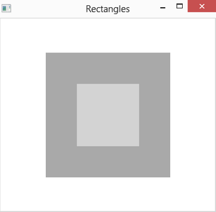
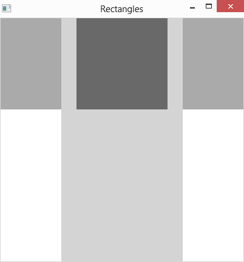
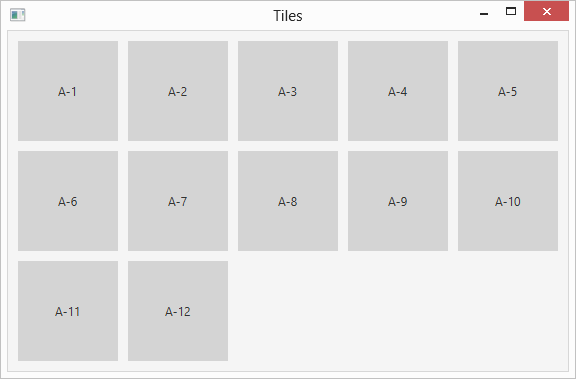
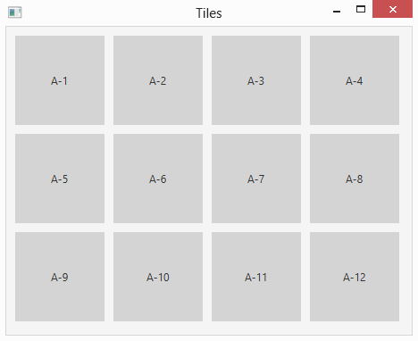

# 第 11 章  更多与精确场景设计有关的布局面板

> **In This Chapter**
>
> - Using four more layout panes to create spectacular layouts 
> - Introducing rectangle shapes
> - Adding scroll bars to a layout 
> - Creating two complete programs

In Chapter 5, you can read about how to work with four basic layout pane classes that let you control the arrangement of controls in a scene: HBox, which arranges nodes horizontally; VBox, which arranges nodes vertically; FlowPane, which arranges nodes both horizontally and vertically; and BorderPane, which divides the scene into five regions: Top, Right, Bottom, Left, and Center.

In this chapter, you discover four additional layout panes that give you additional ways to arrange the elements in a scene. Specifically, you discover how to use the following five layout pane classes:

> ✓ StackPane: The StackPane class is a bit different than the other layout panes in that it doesn’t visually separate nodes from one another. Instead, it displays nodes directly on top of each other. For example, if you add a rectangle shape and a text shape to a stack pane, the text will appear directly over the rectangle.
>
> ✓ AnchorPane: This layout lets you anchor nodes to the top, right, bottom, left, or center of the pane. As the pane resizes, the nodes are repositioned but remain tied to their anchor points. Note: A node can be anchored to more than one position. For example, you might anchor a node to the top and the right. Then, when you resize the pane, the node will remain near the top-right corner of the pane.
>
> ✓ GridPane: Arranges nodes in a grid of rows and columns. The grid does not have to be uniformly sized like a chess board. Instead, the width of each column and the height of each row can vary according to its content. In addition, content can span columns or rows. GridPane is an ideal layout type for forms that gather information from the user via user interface controls such as text boxes, list boxes, and so on.
>
> ✓ TilePane: If you want a layout that resembles a chess board, in which each cell in a grid is the same size, TilePane is the layout pane you’re looking for. TilePane is ideal for organizing thumbnails of image files or other objects of the same size.
>
> ✓ ScrollPane: Technically, the ScrollPane class is not a layout pane at all; it inherits the Control class, not the Pane class. However, it’s primary use is to create layouts that are too large to display all at once and so require a scroll bar to allow the user to pan left and right or up and down (or both) to see all its contents.

Keep in mind that layout panes are typically used in combinations to create the complete layout for your scene. For example, you might use a GridPane to organize user input controls and then place the GridPane in the center section of a BorderPane to place it in the middle of the scene. Or, you might use VBox panes to display labels beneath image thumbnails and then add the VBox panes to a tile pane to display the labeled images in a tiled arrangement.

## Using the StackPane Layout

A stack pane layout is unusual in that it does not arrange its nodes by spreading them out so that you can see them all. Instead, it stacks its nodes one on top of the other so that they overlap. The first node you add to a stack pane at the bottom of the stack; the last node is on the top.

You will most often use a stack pane layout with shapes rather than controls. Because I haven’t yet covered shapes, I limit the examples in this section to simple rectangles created with the Rectangle class. You can read more about this class in Chapter 13. For now, just realize that you can create a rectangle like this:

```java
Rectangle r1 = new Rectangle(100,100);
```

To add a fill color, call the setFill method, like this:

```java
r1.setFill(Color.RED);
```

The Color class defines a number of constants for commonly used colors. In this section, I use just three: LIGHTGRAY, DARKGRAY, and DIMGRAY.

The Rectangle class is in the javafx.scene.shape package, and the Color class is in javafx.scene.paint. Thus, you need to include the following import statements to use these classes:

```java
import javafx.scene.shapes.*; 
import javafx.scene.paint.*;
```

To create a stack pane, you use the StackPane class, whose constructors and methods are shown in Table 11-1.

**Table 11-1 StackPane Constructors and Methods**

| Constructor                 | Description                                                  |
| --------------------------- | ------------------------------------------------------------ |
| StackPane()                 | Creates an empty stack pane.                                 |
| StackPane(Node... children) | Creates a stack pane with the specified child nodes. This constructor lets you create a stack pane and add child nodes to it at the same time. |

| Method                                          | Description                                                  |
| ----------------------------------------------- | ------------------------------------------------------------ |
| ObservableList\<Node\> getChildren()            | Returns the collection of all child nodes that have been added to the stack pane. The collection is returned as an ObservableList type, which includes the methods add and addAll, which lets you add one or more nodes to the list. |
| static void setAlignment (Pos alignment)        | Sets the alignment for child nodes within the stack pane. See Table 5-5 in Chapter 5 for an explanation of the Pos enumeration. |
| static void setMargin(Node child, Insets value) | Sets the margins for a given child node. See Table 5-2 in Chapter 5. |
| void setPadding(Insets value)                   | Sets the padding around the inside edges of the stack pane. See Table 5-2 in Chapter 5 for an explanation of the Insets class. |

The simplest way to create a stack pane is to first create the nodes that you will place in the pane and then call the StackPane constructor, passing the child nodes as parameters. For example:

```java
Rectangle r1 = new Rectangle(100,100); 
r1.setFill(Color.DARKGRAY); 
Rectangle r2 = new Rectangle(50,50); 
r2.setFill(Color.LIGHTGRAY); 
StackPane stack = new StackPane(r1, r2);
```

Here, I first create a pair of rectangles, one 100x100, the other 50x50. The larger rectangle is filled dark gray, the smaller one light gray. Then, I create a stack pane that holds the two rectangles. Figure 11-1 shows how this pane appears when displayed. As you can see, the smaller rectangle is displayed within the larger one.

> Figure 11-1: Two rectangles displayed in a StackPane.



If you prefer, you can call the getChildren method to add nodes to the stack pane, like this:

```java
stack.getChildren().add(r1); 
stack.getChildren().add(r2);
```

Or like this:

```java
stack.getChildren().addAll(r1,r2);
```

Note: The order in which you add nodes to a stack pane has a major impact on how the child nodes are displayed. For example, suppose you reversed the order in which the two rectangles are added:

```java
stack.getChildren().addAll(r2,r1
```

Then, the larger rectangle will be displayed over the top of the smaller one. The result is that the user will see only the larger rectangle. (Unless, of course, the larger rectangle is transparent. I discuss how to create transparent shapes in Chapter 13.)

By default, the objects in a stack pane are centered on top of one another. You can change that by using the setAlignment method. The argument for this method is of type Pos, the same as for other layout panes that have a setAlignment method. If you need a refresher on the Pos enumeration, flip to Table 5-5 in Chapter 5. Here’s an example that displays three rectangles of various sizes aligned at the top left of the stack pane:

```java
Rectangle r1 = new Rectangle(400,150); 
r1.setFill(Color.DARKGRAY);

Rectangle r2 = new Rectangle(200, 400); 
r2.setFill(Color.LIGHTGRAY);

Rectangle r3 = new Rectangle(150,150); 
r3.setFill(Color.DIMGRAY);

StackPane stack = new StackPane(r1, r2, r3); 
stack.setAlignment(Pos.TOP_CENTER);
```

Figure 11-2 shows how this pane appears when displayed in a scene.

> Figure 11-2: Three rectangles displayed with top-center alignment.



As with other layout panes, you can use the setPadding method to add padding around the perimeter of the pane. For example, the following line creates a 50-pixel buffer around the edge of the pane:

```java
stack.setPadding(new Insets(50));
```

The setPadding method accepts an argument of type Insets. For more information about the Insets class, flip to Table 5-2 in Chapter 5.

You can also add margins to individual nodes within a stack pane. To do so, call the setMargin method, passing both the node and an Insets object that describes the margin:

```java
stack.setMargin(r1, new Insets(25));
```

## Using the TilePane layout

The tile pane layout is similar to the flow pane layout: It arranges nodes in neat rows and columns, either horizontally or vertically. The crucial difference is that in a tile pane layout, all the cells are the same size. The tile pane layout calculates the size of the largest node in its child node collection and then uses that size as the size for each cell. This creates a nice grid-like appearance, as shown in Figure 11-3.

By default, a tile pane shows five nodes in each row, using as many rows as necessary to display all its nodes. Thus, the tile pane in Figure 11-3 displays its 12 rectangles in two rows of five and a third row of just two.

If you adjust the size of the tile pane, the number of nodes per row adjusts automatically. For example, Figure 11-4 shows the same tile pane resized so that the 12 rectangles are displayed in three rows of four.

> Figure 11-3: A dozen rectangles displayed in a tile pane.



> Figure 11-4: A tile pane automatically rearranges its tiles when the pane is resized.



To create a tile pane, you use the TilePane class, as I describe in Table 11-2.

**Table 11-2 TilePane Constructors and Methods**

| Constructor                                                  | Description                                                  |
| ------------------------------------------------------------ | ------------------------------------------------------------ |
| TilePane()                                                   | Creates an empty tile pane.                                  |
| TilePane(Node. . . children)                                 | Creates a tile pane with the specified child nodes.          |
| TilePane(double hgap, double vgap)                           | Creates an empty tile pane with the specified gaps between rows and columns. |
| TilePane(Orientation orientation)                            | Creates an empty tile pane with the specified orientation. You can specify Orientation.HORIZONTAL or Orientation.VERTICAL. |
| TilePane(double hgap, double vgap, Node. . .children)        |                                                              |
| TilePane(Orientation orientation, double hgap, double vgap)  |                                                              |
| TilePane(Orientation orientation, Node. . . children)        |                                                              |
| TilePane(Orientation orientation, double hgap, double vgap, Node. . . children) |                                                              |

