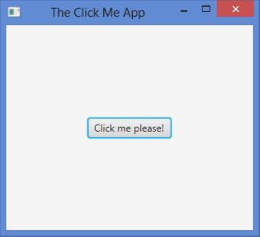
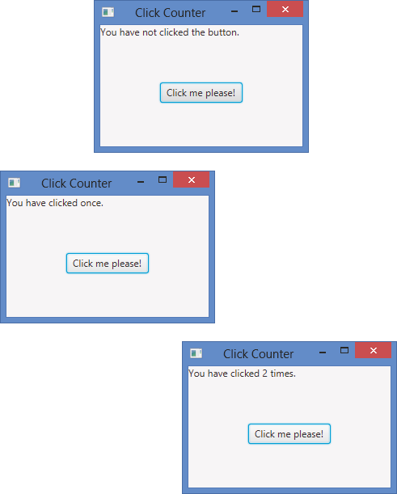

# Chapter 2 Looking Closer at JavaFX Programming

> In This Chapter
>
> + Importing the classes you need to create a JavaFX program
> + Creating a class that extends the JavaFX Application class
> + Using classes such as Button, BorderPane, and Scene to create a user interface
> + Creating an event handler that will be called when the user clicks a button
> + Examining an enhanced version of the Click Me program

In Chapter 1, I introduce you to a simple JavaFX program called the Click Me program and briefly describe how that program works. In this chapter, I put this program under the microscope and examine it in close detail. By the time you finish this chapter, you’ll understand how every line of the Click Me program works and why it’s required. Then, you’ll be ready to start figuring out more nuanced techniques of JavaFX programming.

## Looking Again at the Click Me Program

Figure 2-1 shows the Click Me program in action. As you can see, this program displays a simple button that contains the words Click me please!. What the figure does not show is that when the user clicks the button, the text on the button becomes I’ve Been Clicked!.

> Figure 2-1: The Click Me program in action.



Although this program is simple, it demonstrates most of the essential techniques you need to master to figure out how to write JavaFX programs:

> ✓ It displays a user interface that includes a standard type of user interface control — in this case, a button.
>
> ✓ It responds to the user’s input, generated when the user clicks the button.
>
> ✓ It updates the display to confirm the user’s action.

Many JavaFX programs are variations of this simple theme: Create a user interface, respond to the user’s input, and then update the display to reflect the user’s input. The user interface displayed by a more realistic JavaFX program will undoubtedly display more than just a single button. The processing performed in response to user input will likely include additional steps, such as looking up information in a database or performing calculations. And the display will undoubtedly be updated in more complicated ways than simply changing the text displayed on a button. But variations on these basic elements are found in most real-world JavaFX programs.

Listing 2-1 shows the actual JavaFX code for the Click Me program. In the remaining sections of this chapter, I explain every line of this program in detail.

**Listing 2-1: The Click Me Program**

```java
import javafx.application.*; 
import javafx.stage.*; 
import javafx.scene.*; 
import javafx.scene.layout.*; 
import javafx.scene.control.*;

public class ClickMe extends Application {

  public static void main(String[] args) { 
    launch(args); 
  }

  Button btn;

  @Override 
  public void start(Stage primaryStage) {
    // Create the button 
    btn = new Button(); 
    btn.setText("Click me please!"); 
    btn.setOnAction(e -> buttonClick());

    // Add the button to a layout pane
    BorderPane pane = new BorderPane(); 
    pane.setCenter(btn);

    // Add the layout pane to a scene 
    Scene scene = new Scene(pane, 300, 250);

    // Finalize and show the stage 
    primaryStage.setScene(scene); 
    primaryStage.setTitle("The Click Me App"); 
    primaryStage.show();
  }

  public void buttonClick() {
    if (btn.getText() == "Click me please!") {
      btn.setText("You clicked me!"); 
    } else {
      btn.setText("Click me please!"); 
    }
  }
}
```

## Importing JavaFX Packages

Like any Java program, JavaFX programs begin with a series of import statements that reference the various JavaFX packages that the program will use. The Click Me program includes the following five import statements:

```java
import javafx.application.*; 
import javafx.stage.*; 
import javafx.scene.*; 
import javafx.scene.layout.*; 
import javafx.scene.control.*;
```

As you can see, all the JavaFX packages begin with javafx. The Click Me program uses classes from five distinct JavaFX packages:

> ✓ javafx.application: This package defines the core class on which
>
> all JavaFX applications depend: Application. You read more about the Application class in the section “Extending the Application Class” later in this chapter.
>
> ✓ javafx.stage: The most important class in this package is Stage
>
> class, which defines the top-level container for all user interface objects. Stage is a JavaFX application’s highest-level window, within which all the application’s user-interface elements are displayed.
>
> ✓ javafx.scene: The most important class in this package is the Scene class, which is a container that holds all the user interface elements displayed by the program.
>
> ✓ javafx.scene.layout: This package defines a special type of user-
>
> interface element called a layout manager. The job of a layout manager is to determine the position of each control displayed in the user interface.
>
> ✓ javafx.scene.control: This package contains the classes that define individual user interface controls such as buttons, text boxes, and labels.
>
> The Click Me program uses just one class from this package: Button, which represents a button that the user can click.

## Extending the Application Class

A JavaFX application is a Java class that extends the javafx.application. Application class. Thus, the declaration for the Click Me application’s main class is this:

```java
public class ClickMe extends Application
```

Here, the Click Me application is defined by a class named ClickMe, which extends the Application class.

Because the entire javafx.application package is imported in line 1 of the Click Me program, the Application class does not have to be fully qualified. If you omit the import statement for the javafx.application package, the ClickMe class declaration would have to look like this:

```java
public class ClickMe extends javafx.application.Application
```

The Application class is responsible for managing what is called the lifecycle of a JavaFX application. The lifecycle consists of the following steps:

1. Create an instance of the Application class.

2. Call the init method.

   The default implementation of the init method does nothing, but you can override the init method to provide any processing you want to be performed before the application’s user interface displays.

3. Call the start method.

   The start method is an abstract method, which means that there is no default implementation provided as a part of the Application class. Therefore, you must provide your own version of the start method. The start method is responsible for building and displaying the user interface. (For more information, see the section “Overriding the start Method” later in this chapter.

4. Wait for the application to end, which typically happens when the user signals the end of the program by closing the main application window or choosing the program’s exit command.

   During this time, the application isn’t really idle. Instead, it’s busy performing actions in response to user events, such as clicking a button or choosing an item from a drop-down list.

5. Call the stop method.

   Like the init method, the default implementation of the stop method doesn’t do anything, but you can override it to perform any processing necessary as the program terminates, such as closing database resources or saving files.

## Launching the Application

As you know, the standard entry-point for Java programs is the main method. Here is the main method for the Click Me program:

```java
public static void main(String[] args) { 
  launch(args); 
}
```

As you can see, the main method consists of just one statement, a call to the Application class’ launch method.

The launch method is what actually starts a JavaFX application. The launch method is a static method, so it can be called in the static context of the main method. It creates an instance of the Application class and then starts the JavaFX lifecycle, calling the init and start methods, waiting for the application to finish, and then calling the stop method.

The launch method doesn’t return until the JavaFX application ends. Suppose you wrote the main method for the Click Me program like this:

```java
public static void main(String[] args) {
  System.out.println("Launching JavaFX");
  launch(args);
  System.out.println("Finished"); 
}
```

Then, you would see Launching JavaFX displayed in the console window while the JavaFX application window opens. When you close the JavaFX application window, you would then see Finished in the console window.

## Overriding the start Method

Every JavaFX application must include a start method. You write the code that creates the user interface elements your program’s user will interact with in the start method. For example, the start method in Listing 2-1 contains code that displays a button with the text Click me please!

When a JavaFX application is launched, the JavaFX framework calls the start method after the Application class has been initialized.

The start method for the Click Me program looks like this:

```java
@Override public void start(Stage primaryStage) {
  // Create the button 
  btn = new Button(); 
  btn.setText("Click me please!"); 
  btn.setOnAction(e -> buttonClick());

  // Add the button to a layout pane 
  BorderPane pane = new BorderPane(); 
  pane.setCenter(btn);

  // Add the layout pane to a scene 
  Scene scene = new Scene(pane, 300, 250);

  // Finalize and show the stage 
  primaryStage.setScene(scene); 
  primaryStage.setTitle("The Click Me App"); 
  primaryStage.show();
}
```

To create the user interface for the Click Me program, the start method performs the following four basic steps:

1. Create a button control named btn, set its text to Click me please!, and specify that a method named buttonClick will be called when the user clicks the button. For a more detailed explanation of this code, see the sections “Creating a Button” and “Handling an Action Event” later in this chapter.

2. Create a layout pane named pane and add the button to it.

   For more details, see the section “Creating a Layout Pane” later in this chapter.

3. Create a scene named scene and add the layout pane to it.

   For more details, see the “Making a Scene” section later in this chapter.

4. Finalize the stage by setting the scene, setting the stage title, and showing the stage.

   See the “Setting the Stage” section later in this chapter for more details.

You find pertinent details of each of these blocks of code later in this chapter. But before I proceed, I want to point out a few additional salient details about the start method:

> ✓ The start method is defined as an abstract method in the Application class, so when you include a start method in a JavaFX program, you’re actually overriding the abstract start method.
>
> Although it isn’t required, it’s always a good idea to include the @override annotation to explicitly state that you’re overriding the start method. If you omit this annotation and then make a mistake in spelling the method named (for example, Start instead of start) or if you list the parameters incorrectly, Java thinks you’re defining a new method instead of overriding the start method.
>
> ✓ Unlike the main method, the start method is not a static method.
>
> When you call the launch method from the static main method, the launch method creates an instance of your Application class and then calls the start method.
>
> ✓ The start method accepts one parameter: the Stage object on which
>
> the application’s user interface will display. When the application calls your start method, the application passes the main stage — known as the primary stage — via the primaryStage parameter. Thus, you can use the primaryStage parameter later in the start method to refer to the application’s stage.

## Creating a Button

The button displayed by the Click Me program is created using a class named Button. This class is one of many classes that you can use to create user interface controls. The Button class and most of the other control classes are found in the package javafx.scene.control.

To create a button, simply define a variable of type Button and then call the Button constructor like this:

```java
Button btn; 
btn = new Button();
```

In the code in Listing 2-1, the btn variable is declared as a class variable outside of the start method but the Button object is actually created within the start method. Controls are often declared as class variables so that you can access them from any method defined within the class. As you discover in the following section (“Handling an Action Event”), a separate method named buttonClicked is called when the user clicks the button. By defining the btn variable as a class variable, both the start method and the buttonClicked method have access to the button.

To set the text value displayed by the button, call the setText method, passing the text to be displayed as a string:

```java
btn.setText("Click me please!");
```

Here are a few additional tidbits about buttons:

> ✓ The Button constructor allows you to pass the text to be displayed on the button as a parameter, as in this example:
>
> ```java
> Btn = new Button("Click me please!");
> ```
>
> If you set the button’s text in this way, you don’t need to call the setTitle method.
>
> ✓ The Button class is one of many classes that are derived from a parent class known as javafx.scene.control.Control. Many other classes derive from this class, including Label, TextField, ComboBox, CheckBox, and RadioButton.
>
> ✓ The Control class is one of several different classes that are derived
>
> from higher-level parent class called javafx.scene.Node. Node is the base class of all user-interface elements that can be displayed in a scene. A control is a specific type of node, but there are other types of nodes. In other words, all controls are nodes, but not all nodes are controls. You can read more about several other types of nodes later in this book.

## Handling an Action Event

When the user clicks a button, an action event is triggered. Your program can respond to the event by providing an event handler, which is simply a bit of code that will be executed whenever the event occurs. The Click Me program works by setting up an event handler for the button; the code for the event handler changes the text displayed on the button.

As you read in Chapter 3, there are several ways to handle events in JavaFX. For now, I look briefly at one of the simplest methods, which requires simply that you specify that a method be called whenever the event occurs and then provide the code to implement that method.

To specify the method to be called when the user clicks a button, you call the setOnAction method of the button class. Here’s how it’s done in Listing 2-1:

```java
btn.setOnAction(e -> buttonClick());
```

If the syntax used here seems a little foreign, that’s because it uses a new feature of Java 8 called Lambda expressions. As used in this example, there are three elements to this new syntax:

> ✓ The argument e represents an object of type ActionEvent, which the program can use to get detailed information about the event.
>
> The Click Me program ignores this argument, so you can ignore it too, at least for now.
>
> ✓ The arrow operator (->) is a new operator introduced in Java 8 for use with Lambda expressions.
>
> ✓ The method call buttonClick() simply calls the method named buttonClick.

I discuss Lambda expressions in Chapter 3.

After buttonClick has been established as the method to call when the user clicks the button, the next step is to code the buttonClick method. You find it near the bottom of Listing 2-1:

```java
public void buttonClick() {
  if (btn.getText() == "Click me please!") {
    btn.setText("You clicked me!"); 
  } else {
    btn.setText("Click me please!"); 
  }
}
```

This method uses an if statement to alternately change the text displayed by the button to either You clicked me! or Click me please!. In other words, if the button’s text is Click me please! when the user clicks the button, the buttonClicked method changes the text to You clicked me!. Otherwise, the if statement changes the button’s text back to Click me please!.

The buttonClicked method uses two methods of the Button class to perform its work:

> ✓ getText: Returns the text displayed by the button as a string 
>
> ✓ setText: Sets the text displayed by the button

For more information about handling events, see Chapter 3.

## Creating a Layout Pane

By itself, a button is not very useful. You must actually display it on the screen for the user to be able to click it. And any realistic JavaFX program will have more than one control. The moment you add a second control to your user interface, you need a way to specify how the controls are positioned relative to one another. For example, if your application has two buttons, do you want them to be stacked vertically, one above the other, or side by side?

That’s where layout panes come in. A layout pane is a container class to which you can add one or more user-interface elements. The layout pane then determines exactly how to display those elements relative to each other.

To use a layout pane, you first create an instance of the pane. Then, you add one or more controls to the pane. When you do so, you can specify the details of how the controls will be arranged when the pane is displayed. After you add all the controls to the pane and arrange them just so, you add the pane to the scene.

JavaFX provides a total of eight distinct types of layout panes, all defined by classes in the package javafx.scene.layout. The Click Me program uses a type of layout called a border pane, which arranges the contents of the pane into five general regions: top, left, right, bottom, and center. The BorderPane class is ideal for layouts in which you have elements such as a menu and toolbar at the top, a status bar at the bottom, optional task panes or toolbars on the left or right, and a main working area in the center of the screen.

The lines that create the border pane in the Click Me program are

```java
BorderPane pane = new BorderPane(); 
pane.setCenter(btn);
```

Here, a variable of type BorderPane is declared with the name pane, and the BorderPane constructor is called to create a new BorderPane object. Then, the setCenter method is used to display the button (btn) in the center region of the pane.

Here are a few other interesting details about layout panes:

> ✓ Layout panes automatically adjust the exact position of the elements
>
> they contain based on the size of the elements contained in the layout as well as on the size of the space in which the layout pane is displayed.
>
> ✓ I said earlier that controls are a type of node, and that you would read about other types of nodes later in this book. Well, you just read about one: A layout pane is also a type of node.
>
> ✓ Each region of a border pane can contain a node. Because a layout
>
> pane itself is a type of node, each region of a border pane can contain another layout pane. For example, suppose you want to display three controls in the center region of a border pane. To do that, you’d create a second layout pane and add the three controls to it. Then, you’d set the second layout pane as the node to be displayed in the center region of the first layout pane.
>
> ✓ You read more about the BorderPane class and a few other commonly used layout panes in Chapter 5. You also can read about the layout panes that aren’t as commonly used in Chapter 13.

## Making a Scene

After you create a layout pane that contains the controls you want to display, the next step is to create a scene that will display the layout pane. You can do that in a single line of code that declares a variable of type Scene and calls the Scene class constructor. Here’s how I did it in the Click Me program:

```java
Scene scene = new Scene(pane, 300, 250);
```

The Scene constructor accepts three arguments:

> ✓ A node object that represents the root node to be displayed by the
>
> scene.
>
> A scene can have only one root node, so the root node is usually a layout pane, which in turn contains other controls to be displayed. In the Click Me program, the root note is the border layout pane that contains the button.
>
> ✓ The width of the scene in pixels. ✓ The height of the scene in pixels.

Note: If you omit the width and height, the scene will be sized automatically based on the size of the elements contained within the root node.

You can find out about some additional capabilities of the Scene class in Chapter 4.

## Setting the Stage

If the scene represents the nodes (controls and layout panes) that are displayed by the application, the stage represents the window in which the scene is displayed. When the JavaFX framework calls your application’s start method, it passes you an instance of the Stage class that represents the application’s primary stage — that is, the stage that represents the application’s main window. This reference is passed via the primaryStage argument.

Having created your scene, you’re now ready to finalize the primary stage so that the scene can be displayed. To do that, you must do at least two things:

> ✓ Call the setScene method of the primary stage to set the scene to be displayed.
>
> ✓ Call the show method of the primary stage to display the scene.
>
> After you call the show method, your application’s window becomes visible to the user and the user can then begin to interact with its controls.

It’s also customary to set the title displayed in the application’s title bar. You do that by calling the setTitle method of the primary stage. The last three lines of the start method for the Click Me application perform these functions:

```java
primaryStage.setScene(scene); 
primaryStage.setTitle("The Click Me App"); 
primaryStage.show();
```

When the last line calls the show method, the Stage displays — in other words, the window that was shown in Figure 2-1 displays onscreen.

You can read about additional capabilities of the Stage class in Chapter 4.

## Examining the Click Counter Program

Now that I’ve explained the details of every line of the Click Me program, I look at a slightly enhanced version of the Click Me program called the Click Counter program. In the Click Me program that was shown in Listing 1-1 (in Chapter 1), the text displayed on the button changes when the user clicks the button. In the Click Counter program, an additional type of control called a label displays the number of times the user has clicked the button.

Figure 2-2 shows the Click Counter program in operation. The window at the top of this figure shows how the Click Counter program appears when you first start it. As you can see, the text label at the top of the window displays the text You have not clicked the button. The second window shows what the program looks like after you click the button the first time. Here, the label reads You have clicked once. When the button is clicked a second time, the label changes again, as shown in the third window. Here, the label reads You have clicked 2 times. After that, the number displayed by the label updates each time you click the button to indicate how many times the button has been clicked.

> Figure 2-2: The Click Counter program in action.



Listing 2-2 shows the source code for the Click Counter program, and the following paragraphs describe the key points of how it works:

**Listing 2-2: The Click Counter Program**

```java
import javafx.application.*;                                          // →1
import javafx.stage.*; 
import javafx.scene.*;
import javafx.scene.layout.*; 
import javafx.scene.control.*;

public class ClickCounter extends Application                         // →7
{ 
  public static void main(String[] args)                              // →9
  { 
    launch(args);                                                     // →11
  }

  Button btn;                                                         // →14
  Label lbl;                                                          // →15
  int iClickCount = 0;                                                // →16

  @Override public void start(Stage primaryStage)                     // →18
  { 
    // Create the button 
    btn = new Button();                                               // →21
    btn.setText("Click me please!");                                  // →22
    btn.setOnAction(e -> buttonClick());                              // →23

    // Create the Label 
    lbl = new Label();                                                // →26
    lbl.setText("You have not clicked the button.");                  // →27

    // Add the label and the button to a layout pane 
    BorderPane pane = new BorderPane();                               // →30
    pane.setTop(lbl);                                                 // →31
    pane.setCenter(btn);                                              // →32

    // Add the layout pane to a scene 
    Scene scene = new Scene(pane, 250, 150);                          // →35

    // Add the scene to the stage, set the title 
    // and show the stage 
    primaryStage.setScene(scene);                                     // →39
    primaryStage.setTitle("Click Counter");                           // →40
    primaryStage.show();                                              // →41
  }

  public void buttonClick()                                           // →44
  { 
    iClickCount++;                                                    // →46
    if (iClickCount == 1)                                             // →47
    {
      lbl.setText("You have clicked once.");                          // →49
    }  
    else 
    {
      lbl.setText("You have clicked " + iClickCount + " times." );    // →53
    }
  }
}
```

The following paragraphs explain the key points of the Click Me program:

➝ 1：The import statements reference the javafx packages that will be used by the Click Me program.

➝ 7：The ClickMe class extends javafx.application.Application, thus specifying that the ClickMe class is a JavaFX application.

➝ 9：As with any Java program, the main method is the main entry point for all JavaFX programs.

➝ 11：The main method calls the launch method, which is defined by the Application class. The launch method, in turn, creates an instance of the ClickMe class and then calls the start method.

➝ 14：A variable named btn of type javafx.scene.control.Button is declared as a class variable. Variables representing JavaFX controls are commonly defined as class variables so that they can be accessed by any method in the class.

➝ 15：A class variable named lbl of type javafx.scene.control. Label represents the Label control so that it can be accessed from any method in the class.

➝ 16：A class variable named iClickCount will be used to keep track of the number of times the user clicks the button.

➝ 18：The declaration of the start method uses the @override annotation, indicating that this method overrides the default start method provided by the Application class. The start method accepts a parameter named primaryStage, which represents the window in which the Click Me application will display its user interface.

➝ 21：The start method begins by creating a Button object and assigning it to a variable named btn.

➝ 22：The button’s setText method is called to set the text displayed by the button to Click me please!.

➝ 23：The setOnAction is called to create an event handler for the button. Here, a Lambda expression is used to simply call the buttonClick method whenever the user clicks the button.

➝ 26：The constructor of the Label class is called to create a new label.

➝ 27：The label’s setText method is called to set the initial text value of the label to You have not clicked the button.

➝ 30：A border pane object is created by calling the constructor of the BorderPane class, referencing the border pane via a variable named pane. The border pane will be used to control the layout of the controls displayed on the screen.

➝ 31：The border pane’s setTop method is called to add the label to the top region of the border pane.

➝ 32：The border pane’s setCenter method is called to add the button to the center region of the border pane.

➝ 35：A scene object is created by calling the constructor of the Scene class, passing the border pane created in line 30 to the constructor to establish the border pane as the root node of the scene. In addition, the dimensions of the scene are set to 300 pixels in width and 250 pixels in height.

➝ 39：The setScene method of the primaryStage is used to add the scene to the primary stage.

➝ 40：The setTitle method is used to set the text displayed in the primary stage’s title bar.

➝ 41：The show method is called to display the primary stage. When this line is executed, the window that was shown in Figure 2-1 displays on the screen and the user can begin to interact with the program.

➝ 44：The buttonClick method is called whenever the user clicks the button.

➝ 46：The iClickCount variable is incremented to indicate that the user has clicked the button.

➝ 47：An if statement is used to determine whether the button has been clicked one or more times.

➝ 49：If the button has been clicked once, the label text is set to You have clicked once.

➝ 53：Otherwise, the label text is set to a string that indicates how many times the button has been clicked.

That’s all there is to it. If you understand the details of how the Click Counter program works, you’re ready to move on to Chapter 3. If you’re still struggling with a few points, I suggest you spend some time reviewing this chapter and experimenting with the Click Counter program in TextPad, Eclipse, or NetBeans.

The following paragraphs help clarify some of the key sticking points that might be tripping you up about the Click Counter program and JavaFX in general:

> ✓ When does the program switch from static to non-static? Like every Java program, the main entry point of a JavaFX program is the static main method.
>
> In most JavaFX programs, the static main method does just one thing:
>
> It calls the launch method to start the JavaFX portion of the program. The launch method creates an instance of the ClickCounter class and then calls the start method. At that point, the program is no longer running in a static context because an instance of the ClickCounter class has been created.
>
> ✓ Where does the primaryStage variable come from? The primaryStage variable is passed to the start method when the launch method calls the start method. Thus, the start method receives the primaryStage variable as a parameter.
>
> That’s why you won’t find a separate variable declaration for the primaryStage variable.
>
> ✓ How does the -> operator work? The -> operator is used to create
>
> what is known as a Lambda expression. Lambda expressions are a new feature of Java 8 that are used in situations that would’ve previously required an anonymous class. Don’t worry if you don’t understand how the Lambda expression works. I explain them in detail in Chapter 3.