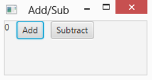

# Chapter 3 Handling Events

> **In This Chapter**
>
> + Understanding important event concepts
> + Working with event-handling classes and interfaces
> + Extending the EventHandler interface
> + Using inner and anonymous classes for event handling
> + Using Lambda expressions for event handling

In Chapter 2, I discuss two programs that display simple scenes that include a button and that respond when the user clicks the button. These programs respond to the event triggered when the user clicks the button by providing an event handler that’s executed when the event occurs.

In this chapter, you read more details about how event handling works in JavaFX. I discuss how events are generated and how they’re dispatched by JavaFX so that your programs can respond to them. You discover the many varieties of events that can be processed by a JavaFX program. And you figure out several programming techniques for handling JavaFX events.

Finally, in this chapter you’re introduced to the idea of property bindings, which let you write code that responds to changes in the value of certain types of class fields, dubbed property fields. In JavaFX, property bindings are sometimes used in situations that would’ve called for an event handler in Swing.

Although event handling is used mostly to respond to button clicks, it can also be used to respond to other types of user interactions. You can use event handling, for example, to write code that’s executed when the user makes a selection from a combo box, moves the mouse over a label, or presses a key on the keyboard. The event-handling techniques in this chapter work for those events as well.

## Examining Events

An event is an object that’s generated when the user does something noteworthy with one of your user-interface components. Then this event object is passed to a special method you create, called an event handler. The event handler can examine the event object, determine exactly what type of event occurred, and respond accordingly. If the user clicks a button, the event handler might write any data entered by the user via text fields to a file. If the user passes the mouse cursor over a label, the event handler might change the text displayed by the label. And if the user selects an item from a combo box, the event handler might use the value that was selected to look up information in a database. The possibilities are endless!

An event is represented by an instance of the class javafx.event.Event or one of its many subclasses. Table 3-1 lists the most commonly used event classes.

**Table 3-1 Commonly Used Event Classes**

| Event Class | Package             | Description                                                  |
| ----------- | ------------------- | ------------------------------------------------------------ |
| ActionEvent | javafx.event        | Created when the user performs an action with a button or other component. Usually this means that the user clicked the button, but the user can also invoke a button action by tabbing to the button and pressing the Enter key. This is the most commonly used event class, as it represents the most common types of user-interface events. |
| InputEvent  | javafx. scene.input | Created when an event that results from user input, such as a mouse or key click, occurs. |
| KeyEvent    | javafx. scene.input | Created when the user presses a key on the keyboard. This event can be used to watch for specific keystrokes entered by the user. (KeyEvent is a subclass of InputEvent.) |
| MouseEvent  | javafx. scene.input | Created when the user does something interesting with the mouse, such as clicking one of the buttons, dragging the mouse, or simply moving the mouse cursor over another object. (MouseEvent is a subclass of InputEvent.) |
| TouchEvent  | javafx. scene.input | Created when a user initiates a touch event on a device that allows touch input. |
| WindowEvent | javafx.stage        | Created when the status of the window (stage) changes.       |

Here are four important terms you need to know:

> ✓ Event: An object that’s created when the user does something noteworthy with a component, such as clicking it.
>
> ✓ Event source: The object on which the event initially occurred. ✓ Event target: The node that the event is directed at.
>
> This is usually the button or other control that the user clicked or otherwise manipulated. (In most cases, the event source and the event target are the same.)
>
> ✓ Event handler: The object that listens for events and handles them when they occur.
>
> The event-listener object must implement the EventHandler interface, which defines a single method named handle (see Table 3-2). The EventHandler interface is defined in the package javafx.event.

**Table 3-2 The EventHandler Interface**

| Method                 | Description                 |
| ---------------------- | --------------------------- |
| void handle\<T event\> | Called when an event occurs |

## Handling Events

Now that you know the basic classes and interfaces that are used for event handling, you’re ready to figure out how to wire them to create a program that responds to events.

In this section, I discuss how to implement the event handler by coding the program’s Application so that in addition to extending the Application class, it also implements the EventHandler interface. In subsequent sections of this chapter, I discuss alternative techniques to implement event handlers that are more concise and, in many cases, easier to work with.

Note that the programs that were shown in Chapters 1 and 2 use the concise Lambda expressions technique, and most of the programs featured throughout the rest of this book also use Lambda expressions. But it’s important that you know the other techniques so that you have a complete understanding of how event handling actually works.

Here are three steps you must take to handle a JavaFX event:

1. Create an event source.

   An event source is simply a control, such as a button, that can generate events. Usually, you declare the variable that refers to the event source as a private class field, outside the start method or any other class methods:

   ```java
   private Button btn;
   ```

   Then, in the start method, you can create the button like this:

   ```java
   btn = new Button(); 
   btn.setText("Click me please!");
   ```

2. Create an event handler.

   To create an event handler, you must create an object that implements the EventHandler interface and provides an implementation of the handle method.

   Here are four ways to create an event handler:

   - Add implements EventHandler to the program’s Application class and provide an implementation of the handle method.

     You figure out how to use this technique in the section “Implementing the EventHandler Interface.”

   - Create an inner class that implements EventHandler within the Application class.

     You figure out how to use this technique in the section “Handling Events with Inner Classes.”

   - Create an anonymous class that implements EventHandler.

     I show you how to use this technique in the section “Handling Events with Anonymous Inner Classes.”

   - Use a Lambda expression to implement the handle method.

     You read about how to use this technique in the section “Using Lambda Expressions to Handle Events.”

3. Register the event handler with the event source.

   The final step is to register the event handler with the event source so that the handle method is called whenever the event occurs.

   Every component that serves as an event source provides a method that lets you register event handlers to listen for the event. For example, a Button control provides a setOnAction method that lets you register an event handler for the action event. In the setOnAction method, you specify the event handler object as a parameter. The exact way you do that depends on which of the various techniques you used to create the event handler.

## Implementing the EventHandler Interface

To see how all these elements work together in a complete program, Figure 3-1 shows the output from a simple program called AddSubtract1. This program displays a label and two buttons, one titled Add and the other titled Subtract. The label initially displays the number 0. Each time the user clicks the Add button, the value displayed by the label is increased by one; each time the user clicks the Subtract button, the value is decreased by one.

Listing 3-1 shows the complete code for this program.

> Figure 3-1: The AddSubtract1 program.



**Listing 3-1: The AddSubtract1 Program**

```java
import javafx.application.*; 
import javafx.stage.*; 
import javafx.scene.*; 
import javafx.scene.layout.*; 
import javafx.scene.control.*; 
import javafx.event.*;
```

